# BOM操作浏览器

## window对象

目标：学习window对象的常见属性，知道各个BOM对象的功能含义

### BOM

- BOM：浏览器对象模型
- BOM>DOM。BOM里面包含DOM

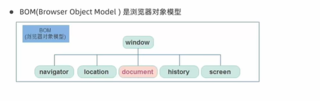

```javascript
// 省略写法
// 因为window是最大的对象,所以在document前都不写window。
window.document === document // 二者相等
```

- window对象是一个全局对象，也可以说是JavaScript中的顶级对象

- document,alert(),console()**这些都是window的属性**，基本BOM的属性和方法都是window的。

- 所有通过var定义在全局作用域中的变量、函数都会变成window对象的属性和方法

  var和直接的函数声明都是挂在window对象内

- **window对象下的属性和方法调用的时候可以省略window**

  （注意区分属性、方法和变量与函数）

### 定时器-延时函数(重要)

- JavaScript内置的一个用来让代码**延迟执行**的函数，叫setTimeout。

- 语法：

  ```javascript
  setTimeout(回调函数,等待的毫秒数)
  ```

- 只运行一次，因此可以理解为把一段代码延迟执行,平时省略window

- **清除延时函数**

  ```javascript
  let timer = setTimeout(回调函数，等待的毫秒数)
  clearTimeoyr(timer)
  ```

- 注意点

  - 延时器需要等待，所以后面的代码先执行
  - 每一次调用演示器都会产生一个新的延时器，演示器返回的id不同

- 区分：两种定时器

  

### JS执行机制(理论知识)

JS代码从上往下执行

浏览器有两个引擎：

- 渲染引擎：解析css和html
- 解析器：解析JS。谷歌是V8引擎

#### 前置知识


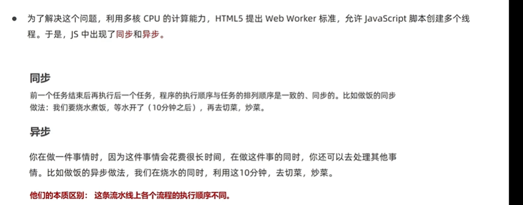

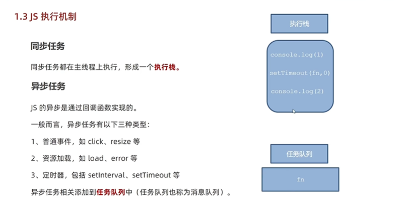


#### JS执行顺序

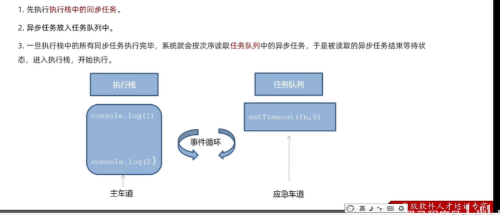

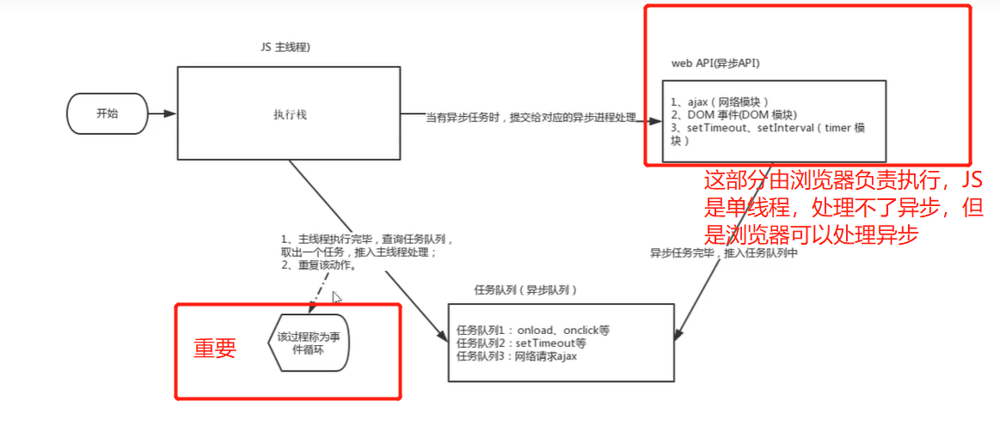


由于主线程不断的重复获得任务、执行任务、在获取任务、再执行，所以这种机制被称为<font color=red>事件循环(envet loop)</font>。

**详细说明**：当JS执行时，任务被分为同步任务和异步任务，同步任务放入任务栈，异步任务交给浏览器处理，执行栈的同步任务执行完成后，去浏览器处理好的任务队列（异步队列）中看是不是有任务要执行。不断的获取与执行的过程。

### location对象

- location的数据类型是对象，它拆分并保存了URL。（location对象属于window，但是书写时省略window）

- **常见的属性和方法**

  - href属性

    可以获取完整的url地址：对href赋值地址，可以实现地址跳转的功能（使用JS方法实现跳转）

    常用场景：用户完成注册后，实现跳转页面

  - search属性

    获取地址中**携带的参数**，符号?后面部分

    要求表单中各个控件有name值，那么在地址栏就会显示用户输入的name后各个参数的值。

  - hash属性

    获取地址中的哈希值，符号#后面的部分

    ```javascript
    console.log(location.hash)
    ```

    后期vue路由的铺垫，**经常用于不刷新页面，显示不同页面**

  - reload()方法

    reload方法用来刷新当前页面，传入参数true是表示强制刷新

    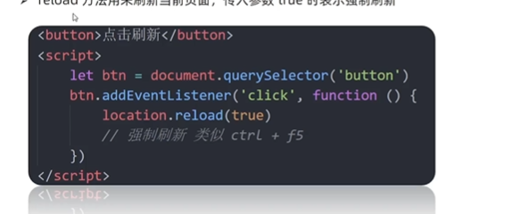

    使用JS方式实现了刷新，效果类似手动点击浏览器上面的刷新。

    可以在页面中写个刷新按钮，用户点击就实现刷新操作。

---

**总结**

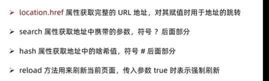

### navigator对象

- navigator的数据类型是对象，该对象下记录了浏览器自身的相关信息

- **常用的属性和方法**

  通过userAgent检测浏览器的版本及平台

  - 自动跳转到移动端页面

  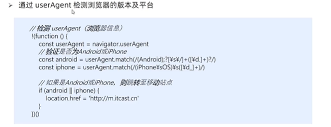

  复制粘贴上面的代码到title下面的script标签中，作用：如果是手机端打开，就转到移动端。

  只需要修改location.href修改为自己的移动端地址。

  上面的叹号代表立即执行函数。

  ```javascript
  // 立即执行函数
  !(function(){})()
  !function(){} ()
  // 上述内容不写叹号也可以
  ```

### history对象

- history的数据类型是对象，主要管理历史记录，该对象与浏览器地址栏的操作相对应，如前进、后退、历史记录等

- 常用的属性和方法

  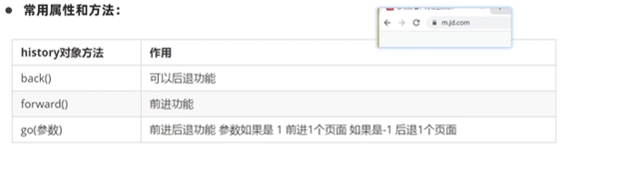

  history对象一般在实际开发中比较少用，但是会在一些OA办公系统中见到。

## 本地存储(重点)

### 本地存储介绍

内存也用来存储数据，但是一刷新就消失了。

本地存储：在本地（浏览器）存储网页数据，刷新不消失。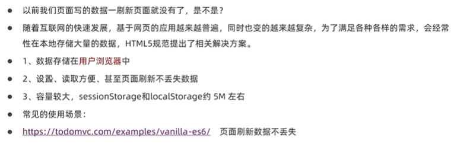

### 本地存储分类

#### localStorage

- 作用：可以将数据**永久存储在本地（用户的电脑硬盘）**，除非手动删除，否则关闭页面后也会存在。
- 特性
  - 多窗口（页面）共享。（但是要前面的域名相同）
  - 以键值对的形式存储

- 语法

```javascript
// 注意:都需要添加引号
// 存储语法：localStorage.setItem('键','值')
localStorage.setItem('uname','pink') 

// 获取语法:localStorage.getItem('键')
console.log(localStorage.getItem('uname'));

// 删除本地存储
localStorage.removeItem('uname')

// 更改
localStorage.setItem('uname','pink')  // 没有键就是增；有键即为改
```

注意：本地存储只能存储字符串类型，哪怕存储的是数字也会转换为字符串类型。所以使用的使用要注意转换类型

#### sessionStorage

- 特性

  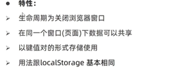

  关闭浏览器窗口，存储的数据就消失。

  使用方法和localStorage基本一致。

---

**总结**

1. localStorage作用是什么？

   可以将数据**永久存储在本地（用户的电脑硬盘）**，除非手动删除，否则关闭页面后也会存在。

2.  localStorage存储、获取、删除的语法是什么？

   - 存储 localStorage.setItem(key,value)

   - 获取 localStorage.getItem(key,value)

   - 删除 localStorage.removeItem(key,value)

   注意：键值都需要添加引号，本地存储只能存字符串。

### 存储复杂数据类型

刚才存储只能每次存储一条数据，非常麻烦。所以能不能存储复杂数据类型，如对象呢？

- 问题：本地只能存储字符串，无法存储复杂数据类型

  直接存储复杂数据类型，会发生以下情况：**看不懂存储的东西是什么**

  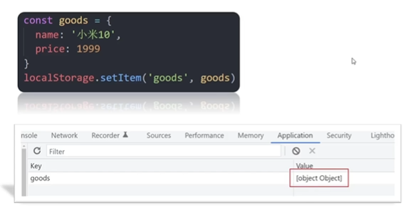

- **解决方法**：

  1. 存：<font color=red>需要将复杂数据类型转换成JSON字符串，在存储到本地</font>。

     **语法**

     ```javascript
     JSON.stringify(复杂数据类型) 
     ```

  2. 取：**获得的JSON对象**转换为对象，方便后续使用。

     这里又遇到一个问题：就是存储数据到localStorage并取的时候，发现里面的内容无法识别，无法直接使用。

- **示例**：

  ```javascript
  const obj = {
        uname : 'pink',
        age : 18,
        gender : 'nv'
  }
  
  // 复杂数据类型存储必须转换为JSON字符串存储
  localStorage.setItem('obj',JSON.stringify(obj))
  // 取
  console.log(localStorage.getItem('obj'))
  // JOSN对象： 属性和值有引号，而且引号都是双引号
  // {"uname":"pink","age":18,"gender":"nv"}
  
  // 更正取：转换为对象类型 
  console.log(JSON.parse(localStorage.getItem('obj')))
  ```


## 知识补充

### **实现字符串拼接新思路**(效果更好，<font color=red>开发常用写法</font>)

- 方法：利用`map()`和`join()`数组方法实现字符串的拼接

- map()使用场景：map()可以遍历数组**处理数据**，并且<font color=red>返回新的数组</font>

  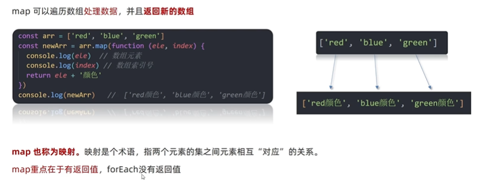

- map()举例：处理原来的数组，把新值存到一个新数组

  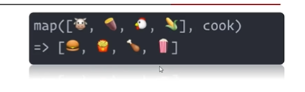

- join()作用：把**数组**中所有元素**转换为一个字符串**

- **语法**

  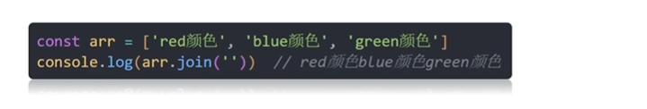

  join括号里面写什么符号，字符串就怎么拼接。

  括号里面什么都不写，默认用逗号分割。

**注意**：不要用map方法遍历数组，因为这样就违背了map的初衷。map最大的特点，可以返回一个<font color=red>可以返回一个数组</font>

## 综合案例

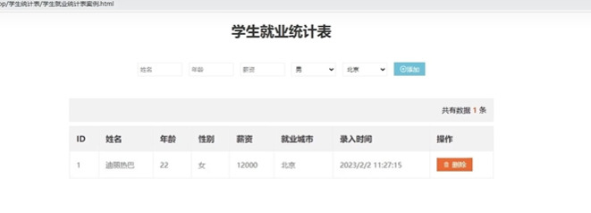

需要完成的业务：

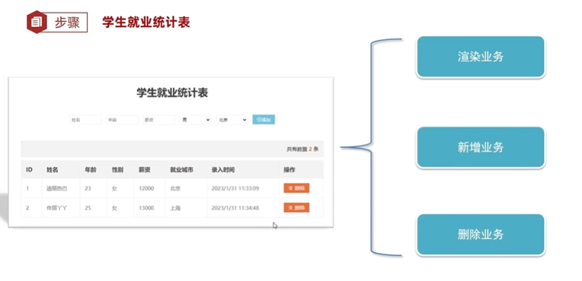

各业务细节：操作要映射到本地存储

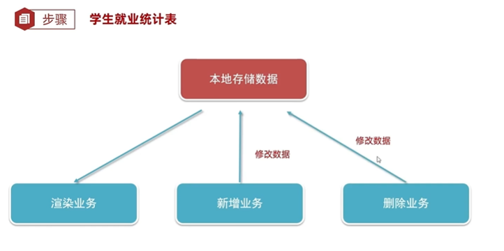


- 渲染业务

  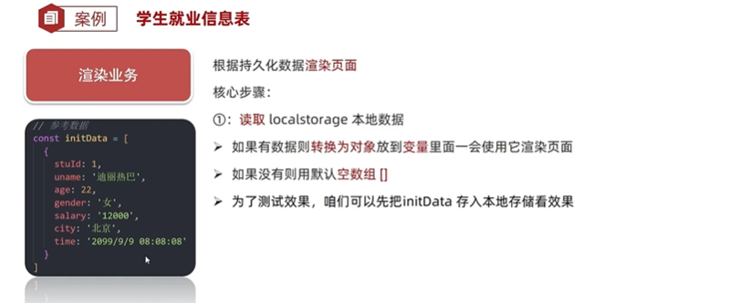

  - **实现字符串拼接新思路**(效果更好，<font color=red>开发常用写法</font>)

    利用`map()`和`join()`数组方法实现字符串的拼接

  - 实现渲染的方法map和join操作

  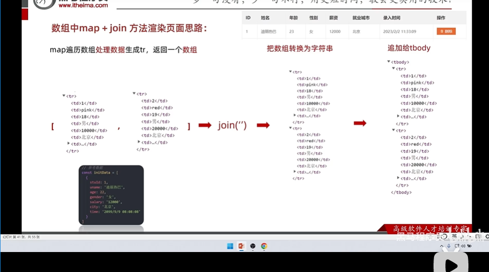

  - 整体思路

    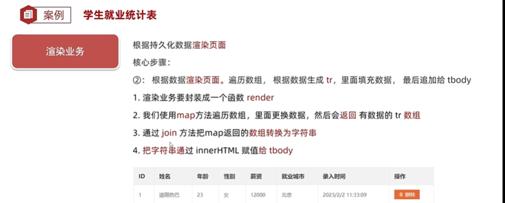

- 新增业务

  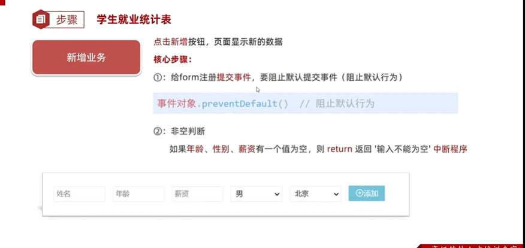

  - 判断表单某个控件输入的内容是否为空

    **需要判断的是表单元素JS.value是否为空，而不是表单元素JS是否为空**

    表单元素JS有很多属性和方法的，它为空说明的是这个节点不存在。

    但是节点是存在的，只是里面的值为空

- 删除业务

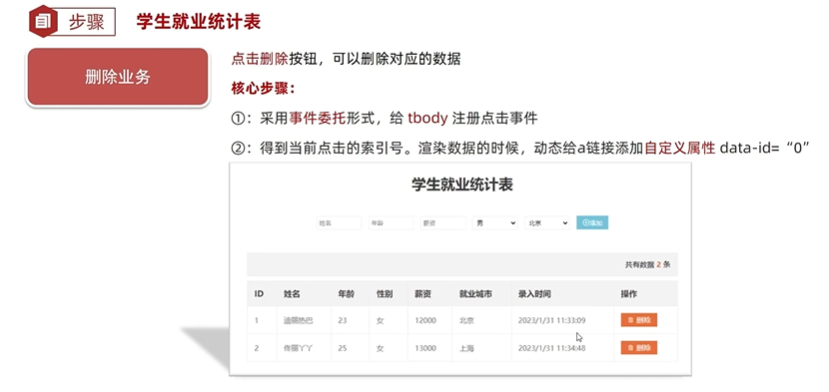


- confirm弹出对话框，返回两个内容:true或者false

- bug:id号，新增数据的id应该是最后一条数据的id号+1.而不是数组长度+1

  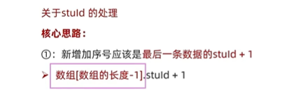

  ```javascript
  // 优雅：下面的方法避免了一个Bug:当里面为空的时,直接赋值为1
  arr.length ? arr[arr.length - 1].stuId + 1 : 1 // 数字0是假
  ```

  ```javascript
  // 下面的不行
  arr[arr.length - 1].stuId + 1  || 1 // 因为左边不是false,而是报错,没办法执行的,不会执行逻辑终端
  ```

  

