# 正则表达式

## 正则表达式

### 介绍

- 正则表达式是用于匹配字符串字符组合的**模式**。在JavaScript中，正则表达式也是对象。

- 通常用来**查找、替换那些符合正则表达式的文本**，许多语言都支持正则表达式。

- 正则表达式在JavaScript中使用的场景：

  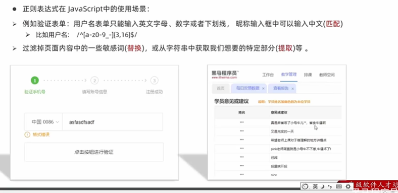

---

**小结**

1. 正则表达式是什么？

   用于匹配字符串中字符组合的模式

2. 正则表达式的作用
   - 表单验证（**匹配**）
   - 过滤敏感词（**替换**）
   - 字符串中提取想要的部分（**提取**）

### 语法(语法)

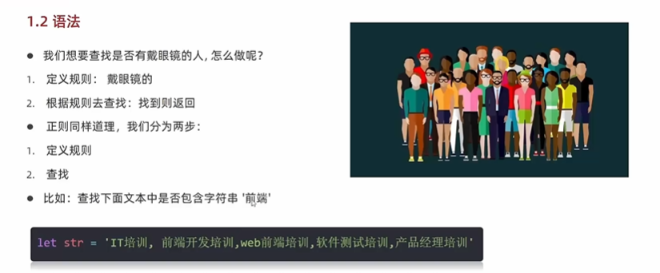

1. 定义规则语法

   ```javascript
   const 变量名 = /正则表达式/   // 经常命名为reg
   ```

2. **判断**是否有符合规则的字符串，返回true或false

   <font color=red>test()</font>方法 用来查看正则表达式与指定字符串是否匹配

   ```javascript
   regObj.test(被检测的字符串)    // 正则表达式在前面
   ```

3. **检索（查找）符合规则的字符串**，如果匹配成功返回数组，否则返回null

   ```javascript
   regObj.exec(被检测的字符串)
   ```

---

**小结**

1. 正则表达式的使用步骤
   - 定义规则 //
   - 匹配 test
2. test和exce的区别？
   - test方法用来判断：字符串是否符合规则，返回的是布尔值
   - exce方法多用于**检索**符合规则的字符串，找到返回数据，否则为null

### 元字符

#### 基础知识

- 普通字符，如字母、数字，只能匹配和自己相同的字符。

- **元字符（特殊字符）**

  一些具有特殊含义的字符，可以**极大提高灵活性和强大的匹配功能。**

  - 比如，规定用户只能输入英文26个字母，普通字符的话要：abcf...xyz
  - 但是元字符写法[a-z]

####  元字符分类

​	元字符很灵活，因此导致很难记忆。为了方便记忆和学习，对元字符进行了分类：

- <font color=red>边界符：表示位置，开头和结尾，必须用什么开头，用什么结尾</font>
- 量词：表示重复次数
- 字符类：更大的简化，比如\d表示0-9

#### 边界符

边界符（位置符）用来<font color=red>提示字符所处的位置</font>，主要有两个字符

| 边界符 | 说明                             |
| ------ | -------------------------------- |
| ^      | 表示匹配行首的文本(**以谁开始**) |
| $      | 表示匹配行尾的文本(**以谁结束**) |

如果\^\$在一起，代表精确匹配。`^哈$` 只有匹配单字`哈`是才是true，多个哈一律是false.

#### 量词

- 量词用来<font color=red>设定某个模式出现的次数</font>

  | 量词 | 说明 |
  | ---- | ---- |
  | *    | 重复0或多次 |
  | +     | 重复1或多次 |
  | ？     | 重复0或1次 |
  |  {n}    | 重复n次 |
  |   {n,}  | 重复n或者多次 |
  |   {n,m}  | 重复n到m次 |

  备注：
  
  - 重复0次，就是前面的字符不出现
  - 下面的大括号更常用，因为更精准。注意：大括号的,左右千万不要加空格

#### 字符类

1. `[]`匹配字符集合

   - 后面的字符串只要包含[]中**任意一个字符**，都返回true
   - 一个[]代表一位

2. 使用连字符`-`表示一个范围

   ```javascript
   [a-z]    表示全部26个小写字母:a-z
   [a-zA-Z] 表示大小写都可以
   [0-9]    表示0-9
   ```

   ```javascript
   // 匹配qq好
   ^[1-9][0-9]{4,}$ // 第一位是1-9,后面的0-9,至少重复4次。那么最低五位
   ```

3. []里面添加`^`代表取反

   注意：只有在中括号里面才是取反

   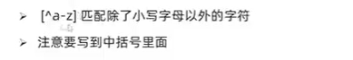

4. `.`匹配除了换行符之外的任何单个字符

5.  预定义类：指的是<font color=red>某些常见模式的简写方式，更高的灵活性</font>

   | 预定类 | 说明                                               |
   | ------ | -------------------------------------------------- |
   | \d     | 0-9之间的数字，相当于[0-9]                         |
   | \D     | \d取反                                             |
   | \w     | 任意的字母、数字和下划线，相当于[A-Za-z0-9_]       |
   | \W     | \w取反                                             |
   | \s     | 匹配空格，换行、制表符、空格符。相当于[\t\r\n\v\f] |
   | \S     | 非空个的字符                                       |

   大写字母均为取反。

   但是在开发中还是习惯使用[]，因为更加直观

#### 案例

- 注意点：`-`写在最后面,不然会识别为范围

  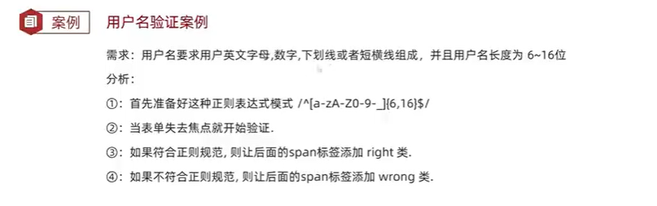

### 修饰符

- 修饰符约束**正则执行的某些细节行为**，如**是否区分大小写、是否支持多行匹配**

- 语法

  ```javascript
  /表达式/修饰符
  ```

  - i是单词ignore的缩写，正则匹配是字母不区分大小写
  - g是单词gloabl的缩写，匹配**所有满足正则表达式的结果**

### 替换replace

```javascript
字符串.replace(/正则表达式/,替换的文本)
```

## 综合案例

用户注册，表单验证案例

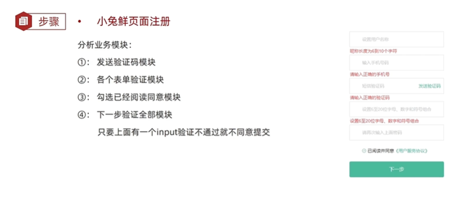


### 发送验证码模块

- 节流法，设置flag变量，控制是否相应用户的点击事件

  需求：当用户点击发送验证码时，之后用户在点击不会相应，直到出现重新发送内容时，用户点击网页才会做出相应的相应。

### 补充：change事件

- 事件：内容发生了变化会触发，不变不触发。

- **使用场景**：

  - 用户输入表单内容，当输入文字后，光标不断获取焦点与消失，但是没有修改内容，这时候就不需要重新验证。

  - 如果是针对失去焦点触发验证，那么太频繁。
  - **使用change代替焦点事件**

### 各个表单的验证模块

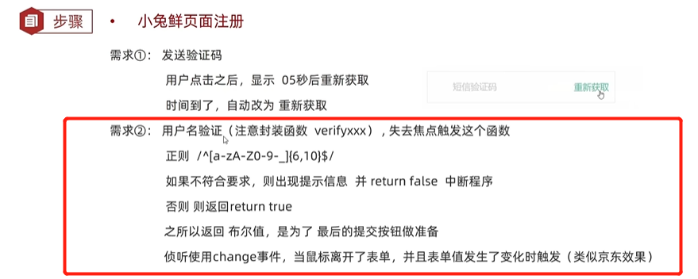

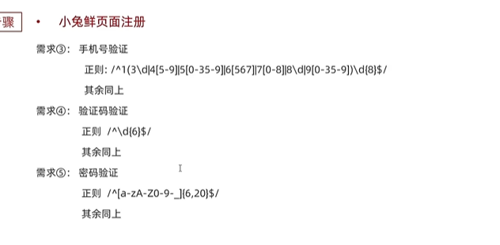

- 注意：除了错误不要看代码，应该第一时间调试

  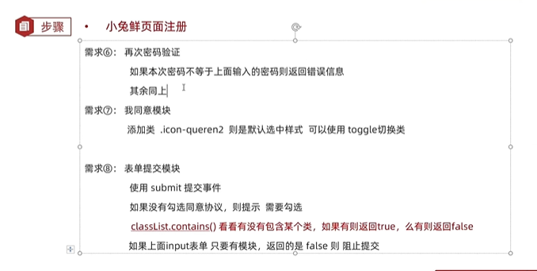

  

## 阶段案例

- required 在input标签里面添加该内容，要求表单内容不能为空，会自动提示。H5新特性

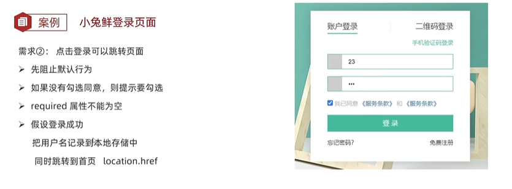

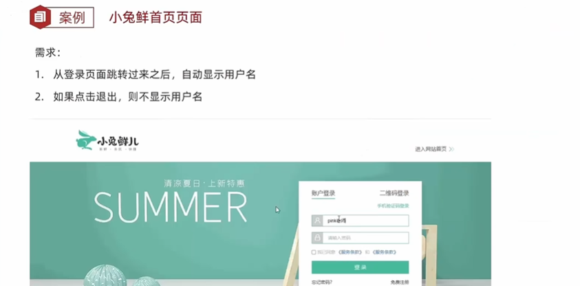

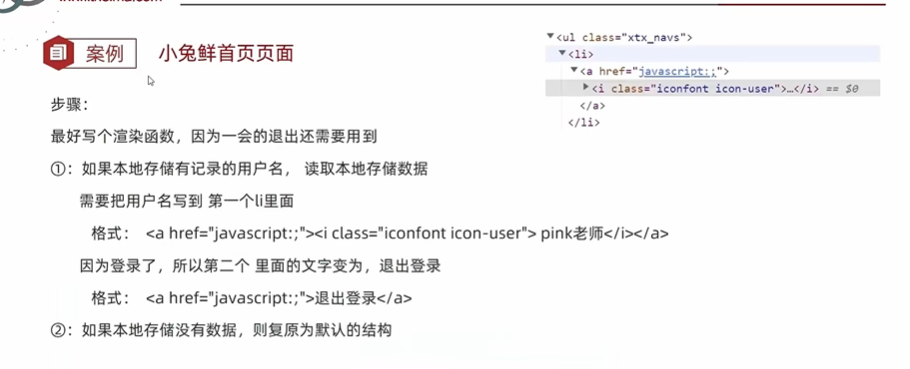

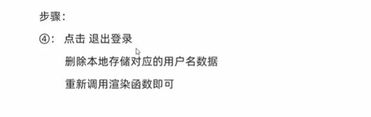
