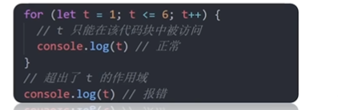
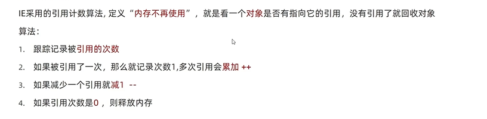
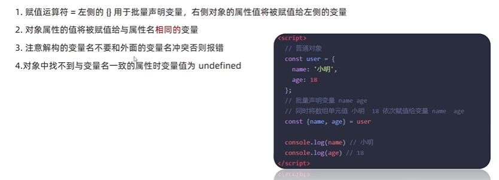

# 作用域&解构&箭头函数

学习目标：

- 掌握作用域等概念加深对JS理解
- 学习ES6新特性让代码书写更加简洁便利
- 不需要写代码，但是面试常问。

## 作用域

**目标**：

- 了解作用域对程序执行的影响
- 作用域链的查找机制
- 使用闭包函数创建隔离作用域**避免全局变量污染**。

**作用域分类:**

作用域：作用域可访问的变量、对象、函数的集合，在JS中对象和函数同样也是变量。简单来说，**作用域是可访问变量的集合**。

- 局部作用域
  - 函数作用域
  - 块作用域
- 全局作用域

### 局部作用域

局部作用域分为函数作用与和块作用域。

#### 函数作用域

函数作用域：在函数内部声明的变量只能在函数内部访问，外部无法直接访问。


1. 函数内部声明的变量，**在函数外部无法访问**

2. 不同函数内部声明的变量**无法互相访问**

3. **函数的参数也是在函数内部的局部变量**

4. 函数执行完毕后，函数内部的变量实际被清空了

#### 块作用域

在JavaScript中使用花括号`{}`包裹的代码成为代码块，**代码块内部声明的变量外部【<font color=red>有可能</font>】无法访问**。



1. let声明的变量会产生块作用域，const声明的常量也会产生块作用域
2. **var不会产生块作用域，**因为使用var声明的变量在块外部也可以访问
3. **不同代码块之间变量无法互相访问**
4. 推荐使用let和const

---

1. 局部作用域分类？

   - 函数作用域 写在函数内部
   - 块作用域     写在花括号{}内部

2. 变量访问原则

   函数内声明的变量在函数外部无法被访问

   块内声明的变量在块外**可能**无法被访问

   (局部作用域声明的变量在变量外部无法使用)

### 全局作用域

全局作用域：在<font color=red>\<script\>标签和.js文件最外层</font>就是全局作用域，在此声明的变量在函数内部(任意地方)也可以被访问。


**注意**

1. 为window对象动态添加的属性默认也是全局，不推荐
2. 函数中**未使用任何关键词声明的变量为全局变量**，不推荐！！！
3. 尽可能少的声明全局变量，防止全局变量污染。

---

**总结**

1. 全局作用域有哪些？

   - \<script\>标签内部
   - .js文件

2. 全局作用域声明的变量其他作用域能使用吗？

   可以

### 作用域链

作用域链的本质：**底层的变量查找机制**

- 在函数被执行时，会<font color=red>优先在当前</font>函数作用域中查找变量(**就近原则**)
- 如果当前作用域查找不到则会依次<font color=red>逐级查找父级作用域</font>直到<font color=red>全局作用域</font>


---

**总结**

1. 作用域链的本质

   底层变量的查找机制

2. 作用域链的查找规则

   - 优先从当前函数作用域查找变量
   - 查找不到，则依次在父级作用域查找变量，直到全局作用域

### JS垃圾回收机制(GC)

#### 基础知识

<font color=red>垃圾回收机制(Garbage Collection)简称GC</font>

JS中<font color=red>内存</font>分配和回收都是<font color=red>自动完成的</font>，内存在不使用的时候会被<font color=red>垃圾回收器自动回收。</font>

- **内存的生命周期**

  JS环境中分配的内存，一般有**如下生命周期:**

  1. **内存分配**：声明变量、函数、对象的时候，系统会自动分配内存

  2. **内存使用**：**即读写内存**，也就是使用变量、函数等

  3. **内存回收**：使用完毕，由**垃圾回收器**自动回收不再使用的内存

- **说明**：

  - 全局变量一般不会回收（关闭页面回收）
  - 一般情况下<font color=red>局部变量的值</font>，不用了会被<font color=red>自动回收</font>

- **内存泄漏**（特殊情况）

  分配的内存无法回收：程序中分配的<font color=red>内存</font>由于某种原因<font color=red>未释放或无法释放</font>叫做<font color=red>内存泄漏。</font>

#### 拓展-JS垃圾回收机制算法

堆栈空间分配区别：

1. 栈（操作系统）：由**操作系统自动分配释放**函数的参数值、局部变量等。**基本数据类型存放在栈里。**
2. 堆（操作系统）：一般由程序员分配释放，若程序员不释放，由<font color=red>垃圾回收机制</font>回收。**复杂数据类型放在堆里面**

##### 引用计数法

基本不用了




##### 标记清除法


### 闭包

目标：能够说出什么是闭包，闭包的作用以及注意事项

概念：一个函数对周围状态的引用捆绑在一起，内层函数中访问到其外层函数的作用域。

简单理解：**闭包=内层函数+外层函数的变量**，要求在**内层函数中使用了外层函数的变量**，如果内层函数不使用外层函数的变量则不算闭包。


**闭包作用**：封闭数据，**外部也可以访问函数内部的变量**

**闭包的基本格式**：


简约写法把返回的函数写在的return后面

**闭包的应用**：实现数据的私有。


- 第一种方式，如果有人在全局修改了count的值，那么就会影响程序的准确性。

- 因此为了实现数据私有，提升数据安全性

  - 将i写为局部变量，这样不会被外面的人修改值影响到

  - 但是局部变量的问题是会被清除：

    但是通过闭包的方式，return了这个函数，有全局变量对函数的引用，所以其中的局部变量不会被垃圾回收机制清除。

    

    中间有人修改了i值，但是不会被影响。


为什么i局部变量不会被回收？


全局变量fun指向fn，fn指向i，所以i不会被回收。因此也看出一个闭包的风险：内存泄漏。

---

**总结**

1. 怎么理解闭包?

   闭包：内层函数+使用了外层函数的变量

2. 闭包的作用?

   - 封闭数据，实现数据私有（不会被外层的全局变量影响，更安全），同时**外部变量也可以访问内部的变量**
   - 闭包很有用，因为它允许函数将与其所操作的某些数据（环境）关联起来

3. 闭包可能引起的问题?

   内存泄漏。

   原因：return了一个函数，存在一个引用，所以内层局部变量不会被回收。

### 变量提升

变量提升是JavaScript中比较奇怪的现状，它**允许变量声明之前即被访问（var声明的变量）。**

- 情况1：未声明变量，直接使用这个名字，会报错。
- 情况2：先使用变量名，在后面用const或let声明变量，报错。
- 情况3：先使用变量名，在后面用var声明该变量，不会报错，此时这个变量的值是undefined。（变量提升）

**注意**：

- 只提升声明，不提升赋值。
- 将**当前作用域**的所有var声明的变量提升到**当前作用域的最前头**。
- 变量在未声明之前访问会报错，但是声明了不赋值返回的是undefined，而不是报错


---

**总结**

1. 用哪个关键字声明变量会变量提升?

   var，不建议使用var变量

2. 变量提升流程？（JS代码底层执行原理）

   - 把var变量的声明提升到当前作用域最前头

   - 只提升变量声明，不提升赋值

     - 提升声明后，访问这个变量返回undefined，程序不会报错

     - 若不提升变量，直接访问未声明变量，程序会报错。
   
   - 然后依次执行代码

## 函数进阶

### 函数提升

1.普通函数声明可以提升

​	函数提升和变量提升比较类似，是指函数在声明之前即可被调用，不会报错。

```javascript
// 执行以下代码不会报错
fn()              //函数提升
function fn(){
     // 代码块
}
```

2.不会被提升的情况：

```javascript
// 特殊：函数表达式 将匿名函数的声明赋值给变量 
fun() // 调用函数,报错。原因：var fun 声明提升，但是赋值不提升,这里调用是错的
var fun = function(){
    console.log('a')
}
```

所以：**函数表达式必须先声明和复制，后调用，否则报错**

---

总结：

1. 函数提升都够使函数的声明调用更加灵活
2. 函数表达式不存在提升的现象
3. 函数的提升出现在相同作用域中
4. 函数提升的流程？
   - 把函数的声明提升到当前作用域最前头

### 函数参数

函数参数的使用细节，能够提升函数应用的灵活度。

学习路径：

- 动态参数
- 剩余参数

#### 动态参数


问题是：不知道用户要传入结果参数，不管传入几个都要计算和。

```javascript
<script>
    function getSum() {
        // console.log(arguments) // 传入的参数
        let sum = 0
        for (let i = 0; i < arguments.length; i++) {
            sum += i
        }
        console.log(sum)
    }
    // 不管传入几个实参，函数都可以调用
    getSum(1,2,3,4)
    getSum(1,2,3,4,5)
</script>
```

---

**总结**

1. 当不确定用户传入多少个实参时，我们怎么办？

   arguments动态参数

2. arguments是什么？

   - 伪数组
   - 它只存在于函数中

#### 剩余参数

目标：能够使用剩余参数

- 剩余参数允许我们将一个不定数量的参数表示为一个数组

- ...是语法符号，**写在最后一个函数形参前面**，用于获取<font color=red>多余的实参</font>(...后面的名字可以随便起)

- 借助...获得的剩余实参，是个<font color=red>真数组</font>

- 使用的时候不需要写...

  开发中，提倡多使用**剩余参数**

```javascript
function getSum(...arr){
    console.log(arr) // arr代表传入的实参

}
getSum(1,2,3)
getSum(1,2,3,4)

function config(baseURL,...other){
    console.log(baseURL)  // 获得: http://www.baidu.con
    console.log(other)    // 获得: ['get','json']
}
// 调用函数
config('http://www.baidu.con','get','json')
```

---

**总结**

1. 剩余参数的主要使用场景？

   也不知道用户会写多少个实参，用于获取多余的参数

2. 剩余参数和动态参数的区别？提倡用那一个？
   - 动态参数返回伪数组
   - 剩余参数返回真数组，提倡使用这个

#### 补充：展开运算符

- 目标：使用展开运算符并说出常用场景

- 语法：展开运算符`...`，讲一个数组展开

  ```javascript
  const arr = [1,2,3] 
  console.log(...arr)         // 但是不常用,因为如果要转换成字符，可以用join()
  console.log(arr.join(','))  // 逗号拼接展开字符串
  ```

- **典型应用场景**：**求数组最大值（最小值）、合并数组等**

  - 数组没有求最大值的方法

    求最大值的方法：Math.max(1,2,3) max()函数中只能写字符的形式。

    ```javascript
    const arr = [1,2,3] 
    ...arr === 1,2,3  // 但是...arr,log()后显示的1 2 3 不带逗号的新式
    console.log(Math.max(...arr))
    ```

  - 合并数组

    ```javascript
    const arr1 = [1,2,3]
    const arr2 = [3,4,5]
    const arr = [...arr1,...arr2]
    ```

- 区分：剩余参数和展开运算符

  剩余参数：在函数参数中使用，得到真数组

  展开运算符：数组中使用，数组展开

  

---

**总结**

1. 展开运算符的主要作用是？

   数组展开，利用求数组最大值和合并数组

2. 展开运算符和剩余参数...有什么区别？

   - 展开：数组展开
   - 剩余：**在函数内部使用**

### 箭头函数(重要)

目标：能够熟悉箭头函数不同写法

**目的**：引入箭头函数的目的是**更简单的函数写法并且不绑定this，箭头函数的语法比函数表达式更简洁**

**使用场景**：箭头函数更适合用于那些本来<font color=red>需要匿名函数的地方</font>

#### 基本语法

https://www.bilibili.com/video/BV1Y84y1L7Nn?p=157&spm_id_from=pageDriver&vd_source=dde2f4dd432156027fedf9b1734ba705

---

**小结**

1. 箭头函数属于表达式函数，因此不存在函数提升

   ```java
   const fn = () => {}

2. 箭头函数只有一个参数时可以省略圆括号()

3. 箭头函数函数体只有一行代码时可以省略花括号{},并自动**作为返回值返回**

4. **加括号的函数体返回对象字面量表达式**

#### 箭头函数参数

1. 普通函数里面有arguments动态参数，在箭头函数中没有

2. 有...剩余参数

   ```javascript
   <script>
       const getSum = (...arr) => {
           let sum = 0
           for (let i = 0; i < arr.length; i++) {
               sum += arr[i]
           }
           return sum
       }
       const result = getSum(1,2)
       const result2 = getSum(1,2,3,4)
       console.log(result,result2)
   </script>
   ```

#### 箭头函数中的this

- <font color=red>箭头函数没有this，箭头函数里面写了this，this会沿用上一层作用域的this</font>

  ```javascript
  /* 以前this的粗略规则:谁调用这个函数,this就指向谁 */
  console.log(this) // 指向window
  
  // 函数里的this
  function fn() {
      console.log(this)
  }
  fn() // this指向window,该行代码等价于 window.fn() 省略了前面的window。window是调用者
  
  // 对象方法里的this
  obj = {
      name: 'pink',
      sayHi: function () {
          console.log('hi')
      }
  }
  obj.sayHi() // this指向obj
  
  
  /*以下为箭头函数的this*/
  const fn = () => {
      console.log(this)
  }
  fn() // this指向window
  
  const obj = {
      uname:'pink',
      sayHi:() => {
          console.log(this)
      }
  }
  obj.sayHi() // 此时，箭头函数的this沿用boj的this,window调用obj,因此指向window
  ```

  下面的箭头函数中的this指向obj


---

**总结**

1. 箭头函数里面有this吗？

   <font color=red>箭头函数不会创建自己的this，它只会**沿用**自己作用域链上一层的this</font>

2. DOM事件**回调函数**推荐使用箭头函数吗？

   - 不太推荐，特别是需要用到this的时候

   - 事件回调函数使用箭头函数时，this为全局的window

     因为this沿用了调用者的this，window调用了调用者

## 解构赋值

- 目标：

  - 解构是一种简洁语法

  - 知道解构的语法及分类，使用解构简洁语法**快速为变量赋值**，必须掌握的很熟悉。
  - 解构的好处
    - 数组结构：可以使用变量，而不使用数组[索引]的形式访问数据，意义更加明确。
    - 对象结构：可以直接使用变量，而不是对象.属性名的方式，写的更加简单。

### 数组解构

#### 基本内容


**数组解构**是将数组的单元值快速批量赋值给一系列变量的**简洁语法**。

**基本语法:**

1. 赋值运算符 = 左侧的[]用于批量声明变量，右侧数组的单元值将被赋值给左侧的变量

2. **变量的顺序**对应**数组单元值**的位置依次进行操作

   

**典型应用**：变量交换值

```javascript
// 数组解构交换变量的值
let a = 1
let b = 3; // 这里必须有分号,不添加分号会报错
[a, b] = [b, a]  // 也有人喜欢把分号加载赋值运算符左边的中括号之前
```

#### 数组结构细节

赋值运算符左边变量的个数和右边数组单元值个数不对应的情况

1. 变量个数>数组单元值个数

   多余的变量的值为:undefined

2. 变量个数<数组单元值个数(或者也不知道要传入几个单元值)

   - 几个变量接受几个值

   - 还可以使用剩余参数接受

     ```javascript
     // 2.变量少，单元值多
     // 如果不确定有多少值传过来,可以使用剩余参数.
     const [e,f,...other] = [1,2,3,4]
     console.log(e)
     console.log(f)
     console.log(other) // 真数组:[3,4]
     ```

3. 防止有undefined传递单元值的情况，可以设置默认值：


4. 按需导入：忽略某些值

   ```javascript
    const [h,i,,k] = [1,2,3,4] // 第三个不要,用逗号隔开
   ```

5. **支持多维数组结构**

   ```javascript
   const [a,b,c] = [1,2,[3,4]]
   console.log(a)
   console.log(b)
   console.log(c) //[3,4]
   
   const [x,y,[m,n]] = [1,2,[3,4]]
   console.log(x) // 1
   console.log(y) // 2
   console.log(m) // 3
   console.log(n) // 4
   ```

#### 补充：代码必须加分号的情况

1. 立即执行函数

   ```javascript
   (function () {})();
   // 或者写成
   ;(function(){})()
   ```

2. 数组解构

   ```javascript
   // 数组开头(直接写[]形式)，特别是前面有语句的一定要注意加分号
   ;[b,a] = [a,b]
   // 和上面的代码分开,不然浏览器会把数组[]和上面的代码合
   ```

---

**总结**

1. 数组解构的作用？

   是将数组的单元值<font color=red>快速批量赋值给</font>一系列变量的<font color=red>简洁语法</font>

2. JS前面有那两种情况需要加分号?
   - 立即执行函数
   - 数组解构，数组[]开头的情况

### 对象解构

**对象解构**是将**对象属性值和方法**快速批量复制给一系列变量的**简洁语法**。

#### 基本对象解构

- **基本语法**

  

  **要求**：被复制的变量名需要和右侧对象中的属性值相同

- **给新的变量名赋值**

  - 原因：因为对象结构要求赋值运算符左侧的变量名需要和对象的属性名相同，**但是如果该变量已经被声明使用了，该怎么办？**

  - 解决方法：**从对象中提取变量并同时修改新的变量名**

  - 语法：

    原变量名：新变量名

    ```javascript
    // 语法
    const { uname: name1, age: age2 } = {
           uname: 'pink老师',
           age: 18
    }
    ```

#### **数组对象解构**

数组对象：数组里面存储了对象

- 普通结构

```java
/* 数组对象解构 */
const pig = [
    {
        uname:'佩奇',
        age:6
    }
]
const [{uname,age}] = pig // 有什么符号,什么符号就一一对应写以及遵守规则
console.log(uname)
console.log(age)
```

#### 多级对象结构

```javascript
<script>
    const pig = {
        name: '佩奇',
        family: {
            mother: '猪妈妈',
            father: '猪爸爸',
            sister: '乔治'
        },
        age: 6
    }
	// 因为对象有很多个,要告诉人家是哪个对象的值
    const { name, family: { mother, father, sister }, age } = pig 
</script>
```

#### 多级数组对象结构

```javascript
/* 多级数组对象结构 */
 const pig = [{
     name: '佩奇',
     family: {
         mother: '猪妈妈',
         father: '猪爸爸',
         sister: '乔治'
     },
     age: 6
 }]
 const [{name,family:{mother,father,sister},age}] = pig
```

#### 重要案例

思想：1.极致的简写 2.从后台获得什么数据就使用什么,不在外面加工

方法：在实参形参传递的时候数据解构，**使用需要的数据**

```javascript
<script>
    // 1. 这是后台传递过来的数据
    const msg = {
        "code": 200,
        "msg": "获取新闻列表成功",
        "data": [
            {
                "id": 1,
                "title": "5G商用自己，三大运用商收入下降",
                "count": 58
            },
            {
                "id": 2,
                "title": "国际媒体头条速览",
                "count": 56
            },
            {
                "id": 3,
                "title": "乌克兰和俄罗斯持续冲突",
                "count": 1669
                
                ]
                
         // 需求1： 请将以上msg对象  采用对象解构的方式 只选出  data 方面后面使用渲染页面
         const { data } = msg
         console.log(data)
        
        // 需求2： 上面msg是后台传递过来的数据，我们需要把data选出当做参数传递给 函数
        // 极致的简写,在传入参数的时候解构数据,获得需要的数据内容
         function render({ data }) {
             // 我们只要 data 数据
             console.log(data)
         }
         render(msg)
                        
        // 需求3， 为了防止msg里面的data名字混淆，要求渲染函数里面的数据名改为 myData
        function render({ data: myData }) {
        // 要求将 获取过来的 data数据 更名为 myData
       		 console.log(myData)
        }
	    render(msg)
</script>
```


## 遍历数组的forEach方法（重点）

- forEach()方法用于调用数组中的每个元素，并将元素传递给回调函数

- 主要使用场景：**遍历数组的每个元素**，加强版for循环；**适合遍历数组对象，越复杂越好**

- **语法**:和map类似，但是不返回值

  ```javascript
  // item 当前数组元素,index 当前数组索引号
  被遍历的数组.forEach(function (item,index){  // item可以省;index参数可省
      // 函数体
  })
  ```

- **例如**：

  ```javascript
  <script>
      const arr = ['red','green','pink']
      arr.forEach(function(item,index){
          console.log(item) 
          console.log(index)
      })
  </script>
  ```

  注意：不返回值，只起遍历作用

- 建议：简单的用for()即可，比较难的forEach比较简单

## 综合案例

### 渲染商品列表案例


Digital Economy, Technological Innovation andHigh-Quality Economic Development Based on Spatial Effect andMediation Effect


