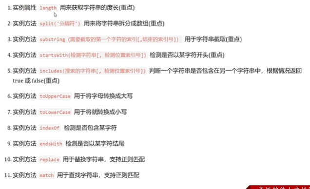

# 构造函数&数据常用函数

## 深入对象

### 创建对象的三种方式

目的：了解创建对象的三种方式

1. **使用`{}字面量`**

   ```javascript
   const obj = {}
   ```

2. **使用new Object()**

   ```javascript
   const obj = new Object({})
   ```

3. **利用构造函数创建对象**

   下一节单独开个函数讲。

### 构造函数

- **构造函数**：是一种特殊的函数，**主要用来初始化对象**。

- **使用场景**：常规的`{...}`语法允许创建一个对象。

  - 使用`{}`字面量我们创建了佩奇的对象，继续创建乔治的对象还需要重新写一遍。**但是他们的属性是相同的，只有值不同**
  - 此时可以通过<font color=red>构造函数来快速创建的多个类似的对象</font>。

- 构造函数的两个约定，（不是法律规定，但是大家都这么做）

  1. 命名以大写字母开头

  2. 只能由“new”操作符来执行

     

  

  说明：

  - 使用new关键词调用函数的行为称为<font color=red>实例化</font>
  - 实例化构造函数时没有参数时可以省略()，但是不提倡省
  - 构造函数内部无需写return，**返回值即为新创建的对象**
  - 构造函数内部的return返回值无效，所以不要写return(有了this就不要写)
  - new Object() ,new Date()也是实例化构造函数

- <font color=red>new构造函数 会发生什么事情？</font>

  1. 创建新的**空对象**，(new关键词：见到new关键字系统为其分配新的内存空间)
  2. 构造函数的this指针指向该新对象（的内存空间）
  3. 执行构造函数代码，修改this，添加新的属性
  4. 返回新对象

---

**总结**


### 实例成员&静态成员

- **实例成员**：<font color=red>通过构造函数创建的对象成为实例对象</font>，<font color=red>实例对象</font>的属性和方法成为实例成员(实例属性和实例方法)。

  - 实例成员
    
    就是构造函数内部通过this添加的成员，实例成员只能通过实例化对象访问。

    - 实例属性
    - 实例对象
    
  - 说明
    1. 为构造函数传入参数，创建了**结构相同但值不同的对象**
    2. 构造函数创建的实例对象<font color=red>彼此独立</font>互不影响

- **静态成员**

  **构造函数**的属性和方法称为**静态成员**(静态属性和静态方法)

  静态成员，在构造函数本身上添加的成员；静态成员只能通过构造函数来访问。

  - 说明
    1. 静态成员只能构造函数来访问
    2. **静态方法中this指向构造函数**
  
  ```javascript
  <script>
          function Star(uname, sex) {
              this.uname = uname;
              this.sex = sex;
              this.sing = function() {
                  console.log("我会唱歌");
              }
          }
          var ldh = new Star("刘德华", "男");
          //1.实例成员就是构造函数内部通过this添加的成员 uname sex sing 就是实例成员
          //实例成员只能通过实例化对象来访问
          console.log(ldh.uname);  //刘德华
          console.log(Star.uname); //不可以通过构造函数来访问实例成员 undefined
          //2.静态成员 在构造函数本身上添加的成员
          Star.age = '18';         //age 就是静态成员
          //静态成员只能通过构造函数来访问
          console.log(Star.age);   //18
          console.log(ldh.age);    //不能通过对象访问 undefined
      </script>
  ```
  
  

---

**总结**

1. 实例成员（属性和方法）写在谁身上？

   - 实例对象的属性和方法即为实例成员
   - 实例对象相互独立，实例成员被实例对象使用

2. 静态成员(属性和方法)写在谁身上？

   - 构造函数的属性和方法成为静态成员

   - 静态成员只能构造函数访问


## 内置构造函数

常见的内置构造函数：Object、Array、String、Number。

- 在JS中最主要的数据类型有6种：

  - **基本数据类型**：

    数值、字符串、布尔型、undefined、null

  - **引用数据类型**

    对象(数组、函数)

**问题**：按道理来说只有**对象**才有属性和方法，那为什么会有下面的情况？

```javascript
// 为什么下面的基本数据类型可以有属性和方法?
// 按道理来说不是只有对象复杂数据类型才有吗?
const str = 'pink'
console.log(str.length)

const num = 12
console.log(num.toFixed(2))

// JS底层
// 基本包装类型:把基本的数据类型包装成了复杂数据类型 (问题的回答)
// 底层完成，把简单数据类型包装成了引用数据类型；不是程序员自己写的
const str2 = new String('pink') 
```

其实字符串、数值、布尔等基本类型也有专门的构造函数，这些我们成为**包装类型**。

JS中几乎所有的数据都可以基于构造函数创建。


但是不用担心，基本数据类型被包装后，检测数据类型还是程序员自己输入的基本数据类型。

### Object

- Object是内置的构造函数，**用于创建普通对象**。

  ```javascript
  // 通过构造函数创建普通对象
  const user = new Object({name:'小明',age:15})
  ```

  但是更推荐使用字面量方式声明对象，而不是Object方式。

- 学习三个常用的**静态方法**（静态方法只有构造函数Object可以调用）

  1. `Object.keys`

     **作用**：获取对象中的所有属性，返回数组形式

     **语法**：

     ```javascript
     // 获得对象的键和值
     const o = { uname: 'pink', age: 18 }
     console.log(Object.keys(o))    //keys()里面的参数代表获得哪个对象的keys
     ```

     **注意**：返回的是一个数组

  2. `Object.value`

     **作用**：获取对象中的所有属性值，返回数组形式

     **语法**：

     ```javascript
     // 获得对象的键和值
     const o = { uname: 'pink', age: 18 }
     console.log(Object.value(o))    //value()里面的参数代表获得哪个对象的值
     ```

     **注意**：返回的是一个数组

  3. `Object.assign`

     **作用**：常用于对象拷贝

     **语法**：

     ```javascript
     // 拷贝
     const o = { uname: 'pink', age: 18 }
     const oo = {}
     Object.assign(oo,o) // 把o给oo,也符合代码的逻辑 oo = o
     console.log(oo)
     ```

     **使用**：经常使用的场景给对象添加属性，可以一次添加多个属性。

     ```javascript
     // 拷贝常用场景：使用方法的方式，给原对象添加新的属性
     Object.assign(o,{gender:'男'})
     console.log(o)  // { uname: 'pink', age: 18 ,gender:'男'}
     ```

### Array

Array是内置的构造函数，用于创建数组

```javascript
const arr = new Array(3,5) // arr = [3,5]
```

但是:创建数组建议使用**字面量创建**，不使用Array构造函数创建。

- 数组常见**实例方法**-核心方法


#### reduce方法

- 作用：<font color=red>reduce</font>返回<font color=red>累计处理的结果，</font>经常用于**求和**等操作

- **基本语法**

  ```javascript
  arr.reduce(function(上一次值，当前值){})        // 省略初始值
  arr.reduce(function(上一次值，当前值){},初始值)  // 未省略初始值
  ```

  参数：如果有起始值，则把初始值累加到里面

- **reduce的执行过程**

  1. (上一次的初始值)如果**没有起始值**，那么上一次值 是 <font color=red>数组元素的第一个值</font>

  2. (上一次的初始值)如果**有起始值**，那么起始值作为最初的上一次的值

  3. 每一次循环，**return返回值 给 上一次的值**。

     若数组元素的个数为n，循环的次数为：

     - 有初始值要循环n次
     - 没有初始值要循环n-1次

- **数组对象计算案例**

  ```javascript
  <script>
      arr = [
          {
              name: 'pink',
              salary: 10000,
          }
          ,
          {
              name: 'red',
              salary: 10000,
          }
          ,
          {
              name: 'blue',
              salary: 10000,
          }
    
      // 想用一个reduce直接计算各个员工的累计工资
      // 错误写法
      const totalerror = arr.reduce((prev, current) => {
          console.log(prev.salary, current.salary)
          //这样是不对的,因为prev一开始是对象,经过一轮计算后面就变成了数字,结构变了,没有.salary属性
          return prev.salary + current.salary
     
      const totalright = arr.reduce((prev, current) => {
          // prev数据类型:一直是数字
          // current数据类型:一直是对象
          return prev + current.salary 
      },0)
      console.log(totalright)
  </script>
  ```

#### 数组常见方法-其他实例方法


#### 数组静态方法

- 作用：将伪数组转换成真数组

- 语法：

  ```javascript
  Array.from(伪数组)      // 返回真数组
  ```


### String

在JavaScript中的字符串、数值、布尔具有对象的使用特征。

#### 常见实例方法

由实例对象调用



**注意**

- substring，字符串截取

  - substr和substring都可以字符串提取，但是建议使用substring
  - `substring(开始的索引号[,结束的索引号])`

  - 如果省略结束的索引号,那么就到最后

  - 结束的索引号不包含在内

- startsWith判断当前字符串是否以另外一个字符串开头

  - 语法

    ```java
    str.starsWith(字符串，[,从第几个字符开始(空格也算)])
    ```

- endsWith判断当前字符串是否以另外一个字符串结尾

- inculdes,判断一个字符串是否包含在另一个字符串中

  ```javascript
  str.includes(字符串[,从第几个字符开始])  // 严格区分大小写
  ```

#### 字符串案例


推荐使用map遍历数组，而不是写for

### Number

- Number是内置的构造函数，用于创建数值

- 常用方法：toFixed()设置保留小数位的长度

  整数也可以保留小数，系统会补0

  

  


## 综合案例

https://www.bilibili.com/video/BV1Y84y1L7Nn?p=173&spm_id_from=pageDriver&vd_source=dde2f4dd432156027fedf9b1734ba705


