# 深入面向对象

熟练理解：原型对象、对象原型

## 编程思想

### 面向过程编程

- <font color=red>面向过程</font>：分析好了步骤，按照**步骤**解决问题。(主要依靠函数)
- 举个例子：炒饭，放油、下米、下菜、炒熟 

### 面向对象编程（oop）

- <font color=red>面向对象</font>就是把事务分解成为一个个对象，然后对象之间分工合作。

  <font color=red>以**功能**划分问题，而不是步骤</font>。（不是一条线，而是发散的关系）

- 举个例：盖浇饭

  

- 面向对象的特性：
  - 封装性
  - 继承性
  - 多态性

### 二者对比

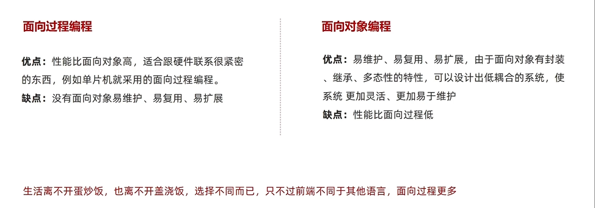

## 构造函数

- 封装是面向对象中比较重要的一部分，**js面向对象可以通过构造函数实现封装。**（在构造函数里面写一些公共的属性和方法）（构造函数等价于Java中的类）
- 借助构造函数创造出来的**实例对象**之间彼此互不影响。

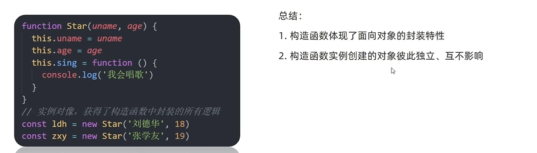

- 问题：

  使用<font color=red>构造函数创建实例对象</font>会存在内存浪费的问题。

  上面的代码，各个实例对象的say方法都一样。但是方法均在堆里面创建了新的对象。

  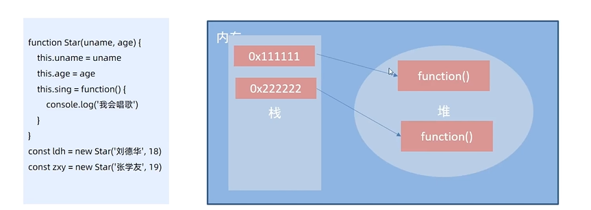

---

**总结**

1. JS实现面向对象通过什么实现？
   - 构造函数

2. 构造函数存在什么问题？
   - 复杂数据类型会，浪费内存

## 原型

各个对象在构造函数中的**方法**一样，重复在内存中实现，很浪费，该怎么解决？可以只生成一份吗？（构造函数存储的数据不一样，只是数据属性名称一样）

原型可以解决构造函数浪费内存的问题。

### 原型

目标：能够利用原型对象实现**方法共享**

- 基础：

  - 构造函数**原型**分配的函数是<font color=red>所有对象所共享的。</font>

  - JavaScript规定，<font color=red>每一个构造函数都有一个prototype属性</font>，指向另一个对象，我们也称为原型对象。

  - 这个对象可以挂在函数，**对象实例化方法不会多次创建原型上的函数**，节约内存。

- 解决方法：

  - <font color=red>可以把那些不变的方法，直接定义在prototype对象上，这样所有的对象就可以共享这些方法</font>

  - <font color=red>构造函数和原型对象中的this都指向 实例化对象。</font>

    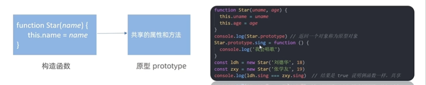

    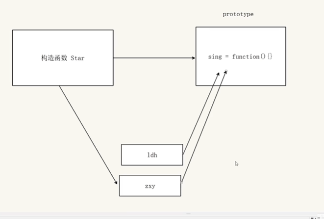

    

---

**小结**

1. 原型是什么？

   - 原型是构造函数的一个属性，是对象类型

   - 一个对象，也称为prototype为<font color=red>原型对象</font>

2. 原型的作用是什么？

   - 共享**方法**
   - <font color=red>可以把那些不变的方法，直接定义在prototype对象上</font>

3. 构造函数和原型里的this指向谁？

   - 都指向实例化对象

     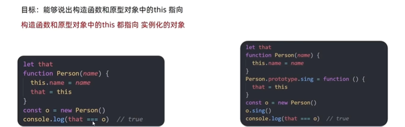

### 补充：数组拓展

```javascript
// 展开运算符
console.log(...[1, 2, 3]);        // 展开得到数字类型
console.log([1, 2, 3].join(',')); // 字符类型
```

需求:

-  自己定义数组的拓展方法，实现最大值

- 要求:自己定义的方法，任何一个实例对象的都可以使用；因此将自定义发放写到数组.prototype上

```javascript
const arr = [1, 2, 3]

/*1. 最大值 */
Array.prototype.max = function (arr) {
    // 返回undefined,没有接受到参数值:因为在arr.max()调用时，没在max()里面写参数。                                   // 如果在()里面写arr参数,那么就很重复，因为前面调用的时候已经写过了，解决方法见下。
    console.log(arr)       
    return Math.max(...arr)
}

// 不想重复写arr作为参数的方法,巧妙利用this
Array.prototype.max = function () {
    // 巧妙利用this
    return Math.max(...this) // this指向调用者
}
const max = arr.max()
console.log(max)
```

```javascript
// 实现求和
Array.prototype.sum = function () {
      return this.reduce((prev,item) => prev+item, 0)
}
console.log(arr.sum())
```

### constructor属性

**在哪里？**每个原型对象里面都有一个constructor属性

**作用：**该属性<font color=red>指向</font>该原型对象的<font color=red>构造函数</font>。简单理解：指向父亲

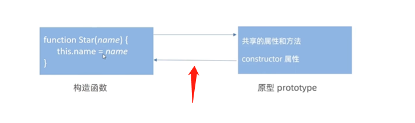

**使用场景：**

- 为了方便，如果有多个对象的方法，可以给原型对象采取**对象形式赋值。**

  但是这样就会**覆盖**构造函数原型对象原来的内容，这样修改后的原型对象consturctor就不再指向当前构造函数了。

- 解决方法

  需要在修改的原型对象中，添加一个consturctor指向原来的构造函数

  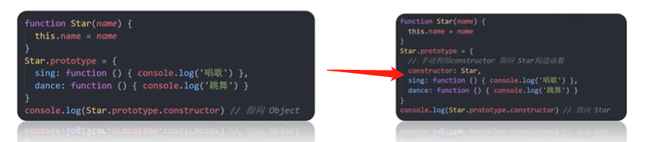

- 案例

  ```javascript
  function Star() {
  }
  console.log(Star.prototype)
  Star.prototype = {
      // 重新指回创造原型对象的构造函数
      constructor : Star, // 注意符号是:,在对象里面
      
      sing: function () {
          console.log('唱歌')
      },
      dance: function () {
          console.log('跳舞')
      }
  }
  console.log(Star.prototype)

---

**小结**

1. constructor属性的作用是什么？

   指向该原型对象的构造函数（在对prototype对象重新赋值的时候）

### 对象原型

https://www.bilibili.com/video/BV1Y84y1L7Nn/?p=181&spm_id_from=pageDriver&vd_source=dde2f4dd432156027fedf9b1734ba705 有个笔记和案例没做

为什么实例对象可以访问原型对象中的方法？

- **对象都会有一个属性**`__proto__`，指向构造函数的prototype对象 (注意`__proto__`是两个下划线)
- 对象可以访问prototype对象的属性和方法（主要是方法），就是因为对象有`__proto__`原型的存在。

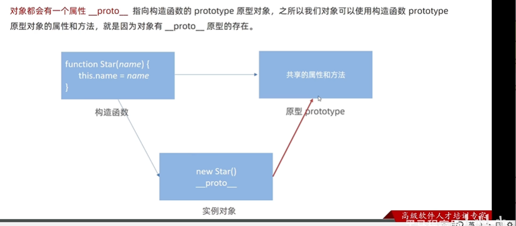


<font color=red>构造函数、原型对象、对象原型之间的关系</font>

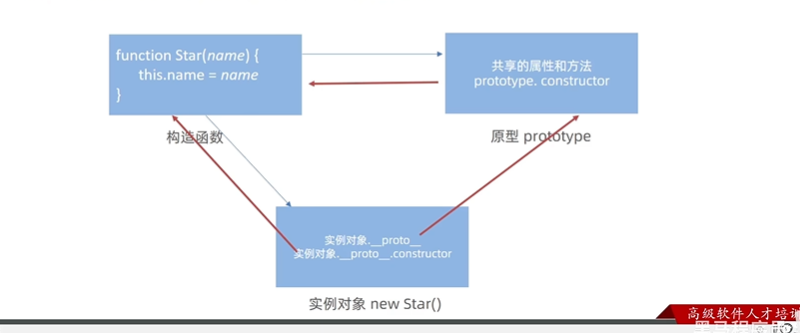

---

**小结**

1. prototype是什么？来自哪里？
   - 原型（原型对象）
   - 来自于构造函数
2. constructor属性在哪里？作用？
   - 在prototype对象和对象原型\_\_proto\_\_中
   - 都指向创建实例对象/原型的构造函数

3. \_\_proto\_\_属性在哪里？指向谁？
   - 在实例对象中
   - 指向原型对象prototype

### 原型继承

#### 基础知识

- 继承是面向对象编程的另一个特征，**通过继承进一步提高代码的封装程度**。

- JavaScript中大多是借助**原型对象实现继承的特性**。简称：原型继承

- 继承案例

```javascript
 <script>
	const Person ={
	    eyes:2,
	    head:1
	}
	// 构造函数，通过继承实现
	function Woman(){}
	function Man(){}
	
	// 女人继承
	Woman.prototype = Person
	// prototype重新指向构造函数
	Woman.prototype.constructor = Woman 
	
	// 给女人添加专有方法,生孩子；挂在woman的原型上，因为每个woman都有
	Woman.prototype.baby = function (){
	    console.log('宝贝')
	}
	const red = new Woman()
	console.log(red)
	console.log(Woman.prototype)
	
	// 男人继承
	Man.prototype = Person
	Man.prototype.constructor = Man
	
	const pink = new Man()
	console.log(pink)
	console.log(Man.prototype)
</script>
```

#### 问题

**进行了新的操作，给女人添加专有方法,生孩子**

```javascript
// 给女人添加专有方法,生孩子；挂在woman的原型上，因为每个woman都有
Woman.prototype.baby = function (){
    console.log('宝贝')
}
// 问题：男人和女人的实例化对象均有baby的方法
// 原因：男人和女人的portotype原型对象相等，二者指向同一个对象
Woman.prototype = Person
Man.prototype = Person
```

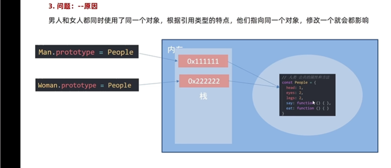

#### **解决方法**

需求：男人和女人不要使用同一个对象，但是不同对象里面包含相同的属性和方法

答案：构造函数

new每次都会创建一个新的对象

```javascript
// 抽取方法更正：要求：结构一样但是对象不一样
function Person() {
    this.eyes = 2,
    this.head = 1
}

// 构造函数，通过继承实现
function Woman() {
}
function Man() {
}

// 女人继承
Woman.prototype = new Person
// prototype重新指向构造函数
Woman.prototype.constructor = Woman

// 给女人添加专有方法,生孩子；挂在woman的原型上，因为每个woman都有
Woman.prototype.baby = function () {
    console.log('宝贝')
}


// 男人继承
Man.prototype = new Person
Man.prototype.constructor = Man
```

---

**小结**

1. 继承的方法

   ```javascript
   子类的原型 = new 父类
   子类.prototype = new 父类
   ```

### 原型链

#### 基础知识

每个对象都有`__proto__`，对象原型。

对象原型

- 只要是对象就有原型（对象），`__proto__`

- 只要是原型对象里面就有`constructor`

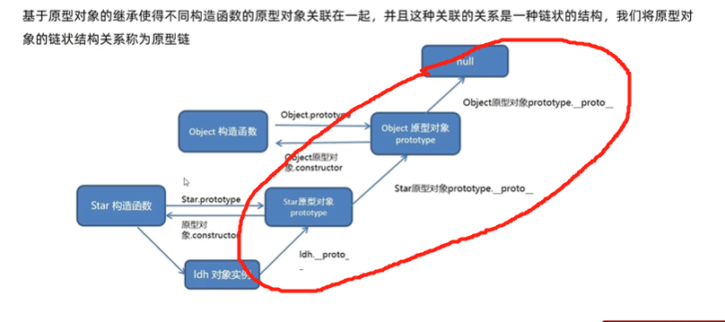

#### 什么是原型链？

原型链是一种查找规则

1. 当访问一个对象的属性（或方法）时，首先查找**这个对象自身**有没有该属性
2. 如果没有，就查找它的**原型**（也就是`__proto__`指向的prototype原型对象）
3. 如果还没有，就查找原型对象的**原型**
4. 依次类推一一直找到Object位置（<font color=red>null</font>）

`__proto__`对象原型的意义在于为**对象成员查找机制提供一个方向，或者一条线路**

可以使用instanceof运算符用于检测构造函数的prototype的属性是否出现在某个实例对象的原型链上。

#### instanceof运算符

```javascript
console.log(ldh instanceof Person)
console.log(ldh instanceof Object)
console.log(ldh instanceof Array)
console.log([1,2,3] instanceof Array)
```

## 综合案例

https://www.bilibili.com/video/BV1Y84y1L7Nn/?p=184&spm_id_from=pageDriver&vd_source=dde2f4dd432156027fedf9b1734ba705
