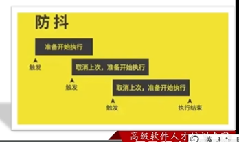

# 高阶技巧

本章的各个点之间没有联系，都是独立的小点。

## 深浅拷贝

- 开发中经常需要**复制**一个对象。如果<font color=red>直接用赋值</font>，那么会存在问题，

```javascript
 <script>
        const obj = {
            uname:'pink',
            age:20
        }
        // 通过赋值复制
        const o = obj
        console.log(o)
        
        o.age = 18
        console.log(o)
        console.log(obj)  // 原来的obj的age也被改了
</script>
```

- 问题：改变o,obj的值也会相应改变
- 原因：o中复制的obj在栈中的地址，对这个地址的内容进行修改都会变。


### 浅拷贝

**首先，浅拷贝和深拷贝只针对引用数据类型**；简单数据类型赋值给的就是值，不会影响。

浅拷贝：简单数据类型直接拷贝值；引用数据类型拷贝地址。（简单理解：如果是单层对象，没问题，如果是多层对象就有问题）

1. 拷贝对象：Object.assgin()                    /  展开运算符{...obj}拷贝对象
2. 拷贝数组：Array.prototype.concat()   / 展开运算符[...arr]


上面的浅拷贝，多层复杂对象的值 改变会影响原对象的值。

---

**小结**

1. 直接赋值和浅拷贝有什么区别？（默认只针对引用数据类型）
   - 直接赋值的方法，只要是对象，都会**相互影响**，因为直接拷贝对象栈里面的地址
   - 浅拷贝如果是一层对象，不相互影响；如果出现多层对象拷贝还会相互影响
2. 怎么理解浅拷贝？
   - 拷贝对象后，里面的**属性值是简单数据类型直接拷贝值**
   - 如果属性值是**引用数据类型则拷贝地址**

### 深拷贝

注意：还是只针对引用类型

深拷贝：拷贝的是对象，不是地址

**常见方法**

1. 递归方式实现深拷贝
2. loadsh / clonedeep
3. 通过JSON.stringify()实现

#### 递归方式实现深拷贝

如果一个函数在内部可以调用其本身，这个函数就是递归函数。

- 简单理解：函数内部自己调用自己，这个函数就是递归函数
- 递归函数的作用和循环效果类似
- 由于递归容易发生**栈溢出**错误(stack overflow)，所以<font color=red>必须要加退出条件return</font>

小案例：

利用递归函数实现setTimeout模拟setInterval效果


## 异常处理

- 了解JavaScript中程序异常的处理方法，**提升代码运行的简况性。**

- 异常处理是指预估代码执行过程中可能发生的错误，然后**最大程度避免错误的发生**导致整个程序无法继续运行。

### throw抛异常

- throw可以实现程序员自定义的异常提示。


---

**小结**

1. 抛出异常用哪个关键字？它会终止程序吗？

   - throw关键字
   - <font color=red>会</font>终止程序，所你以不需要写return

2. 抛出异常经常和谁配合使用？

   Error对象

### try/catch捕获异常

可以通过try/catch捕获错误信息（浏览器提供的错误信息）。try试试，catch拦住，finally最后


- catch不会中断程序的执行，如果不写finally，需要自己在catch里写return

- finally会中断程序的进行，有finally则catch中不需要写return
- 在catch可以结合throw抛出异常，提供更加明显的错误提示

---

**小结**

1. 捕获异常用哪三个关键字？

   - try 可能会出现错误的代码写在这里
   - catch 捕获异常，抛出异常
   - finally 不管有没有异常都会执行

2. 怎么调用浏览器提供的错误信息？

   利用catch提供的参数

### debugger

类似于打断点，只不过是以代码的形式。


## 处理this

###  this指向

1. 普通函数的this指向

普通函数的调用方式决定了this的值，即【谁调用，this的值指向是哦】

- 普通函数中没有明确调用者时this的值是window

- 严格模式下没有调用者是this的值为undefined。

```javascript
<script>
    'use strict'    // 开启严格模式
</script>
```

2. 箭头函数的this指向

   **实际上箭头函数中没有this**。箭头函数的this和普通函完全不同，也不受调用方式影响。

   - 箭头函数会默认绑定外层this的值，所以箭头函数的this和外层是一样
   - 箭头函数中的this引用的就是**最近作用域**中的this
   - 向外层作用域中，一层一层查找this，直到有this的定义

   **注意**，由于箭头函数this的原因，以下情况不建议用箭头函数

   - 需要使用this

   - 基于原型的面向对象也不推荐箭头函数

     ```javascript
     Person.prototype.walk =  function(){ /* 里面会常用this*/} //此处不建议用箭头函数
     const p1 = new Person()
     p1.walk()


---

**小结**

1. 普通函数this指向谁？

   【谁调用this的值指向谁】

2. 普通函数严格模式下指向谁？

   严格模式下执行undefined

3. 箭头函数不存在this，沿用上一级的，过程：向外层作用域中，一层一层查找this，直到有this的定义

4. 不建议用箭头函数的情况？

   - 构造函数
   - 原型函数
   - 字面量对象中的函数
   - dom事件函数

5. **适用情况**

   需要使用上层this的地方

### 改变this

this的指向可以手动改变，在JavaScript中有3个方法可以改变this的指向。

- call()
- apply()
- bind()

#### call

- 使用call方法调用函数，同时指定被调用函数中的this的值

- 语法

  ```javascript
  fun.call(thisArg[,实参])
  ```

  - thisArg:fun函数运行时指定的this值
  - 实参：传递的其他参数
  - 返回值就是函数的返回值，和普通的调用没有区别

#### apply

- 使用apply方法调用函数，同时指定被调用函数中this的值

- 语法

  ```javascript
  fun.apply(thisArg,[argsArray])
  ```

  - thisArg:fun函数运行时指定的this值

  - argsArray：传递的值，**必须包含在数组里面**

  - 返回值就是函数的返回值，因为它就是调用函数

  - apply主要和数组有关系，比如使用Math.max()求数组的最大值

    ```javascript
    Math.max() // 方法不能直接求数组的最大值，之前求要...展开
    
    // 现在使用apply方法求数组最大值
    // 第一个参数：不指向任何或Math都可以
    const max = Math.max.apply(null,[1,2,3]) // max是一个调用方法,采用apply调用
    console.log(max) 
    ```

#### bind-重点

- bind()方法不会调用函数，但能改变函数内部的this指向

  在很多时候，我们不想直接执行，只是想改变函数的指向

- **语法**

  ```javascript
  fun.bind(thisArg,arg1,arg2,...)
  ```

  - thisArg：在fun函数运行时指定this的值
  - arg1,arg2：传递其他的参数值
  - 返回由指定的this值和初始化参数改造<font color=red>原拷贝函数（新函数）</font>
  - 因为当我们指向改变this的指向，并且不想调用这个函数的时候，可以使用bind,比如改变定时器内部的this指向。

#### 三个对比


## 性能优化

### 防抖

#### 基础知识

- **防抖**：单位时间内，频繁触发时间，<font color=red>只执行最后一次</font>

- **举个例子**：王者荣耀回城，只要被打断就得重新来

- **使用场景**：

  - 搜索框输入，只需用户<font color=red>最后一次输入完，在发送请求</font>
  - 手机号、邮箱验证<font color=red>输入检测</font>

  

#### 案例：防抖处理鼠标在盒子上移动


##### 使用lodash实现

```javascript
// 核心代码
<div class="box"></div>
<script>
    const box = document.querySelector('.box')
    let i = 0
    function fn() {
      // 如果函数存在大量消耗性能的代码，可能造成卡顿
      box.innerHTML = i++
    }
    // 利用lodash库实现防抖
    // 鼠标停止500ms之后，屏幕数字才会改变
    box.addEventListener('mousemove', _.debounce(fn,500))
</script>
```

##### 手写防抖函数实现

**核心思路**：防抖的核心就是利用定时器(`setTimeout`)来实现

（面试如果有人问有没有手写过防抖函数?回答下面的即可）

1. 声明一个定时器<font color=red>变量</font>

2. 当鼠标每次滑动都先判断<font color=red>是否有定时器了</font>，如果有定时器先<font color=red>清除以前的定时器</font>

3. 如果没有定时器则<font color=red>开启</font>定时器，记得存到变量里面

4. 在<font color=red>定时器里面调用</font>要执行的函数

   ```javascript
    <script>
       const box = document.querySelector('.box')
       let i = 0
       function mouseMove() {
         // 如果函数存在大量消耗性能的代码，可能造成卡顿
         box.innerHTML = i++
       }
   
       // 手写防抖函数
       // 核心是利用setTimeout定时器来实现
       function debounce(fn, t) {
         let timer
         // 返回一个函数
         return function () {
           if (timer) clearTimeout(timer)
           timer = setTimeout(fn, t)      // fn和t都是传入的参数,注意：fn是回调函数不要写()
         }
       }
       box.addEventListener('mousemove', debounce(mouseMove, 100))
   
       // // 调用函数,返回在里面定义的function匿名函数
       // debounce(mouseMove, 500)
       // // 等价于
       // function(){} // 里面写的匿名函数
   </script>
   ```

---

**小结**

1. 防抖是什么？

   单位时间内，频繁触发时间，只执行最后一次

2. 有什么使用场景？

   * 搜索框输入
   * 手机号，邮箱验证

### 节流

#### 基础知识

- **节流**：单位时间内，频繁触发时间，<font color=red>只执行一次</font>（ps:单位时间不是1s，是你自己定义的时间）

- 举个例子

  - 王者荣耀技能冷却，期间无法继续释放技能

- 使用场景

  高频事件：鼠标移动mousemove、页面尺寸缩放resize、滚动条滚动scroll

  

- 实现方法

  

---

**小结**

1. 节流是什么？

   单位时间内，频繁触发时间，<font color=red>只执行一次</font>

   简单理解：在一定时间内如500ms，不管触发多少次时间，<font color=red>只执行一次</font>

2. 使用场景？

   高频事件：鼠标移动mousemove、页面尺寸缩放resize、滚动条滚动scroll

#### 案例：手写实现节流函数


### 防抖和节流总结


### 节流综合案例

看一个视频，关闭网页后，重新打开后从上一次播放的位置重新播放。


需求：ontimeupdate触发的频次太高了，因此想节流，让他1s存储一次。


