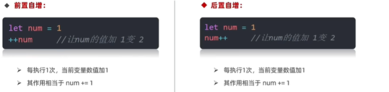
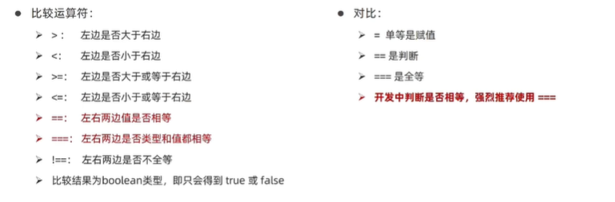
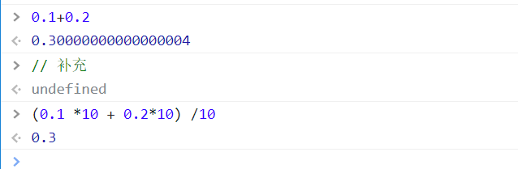
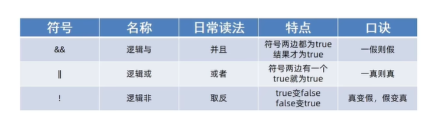
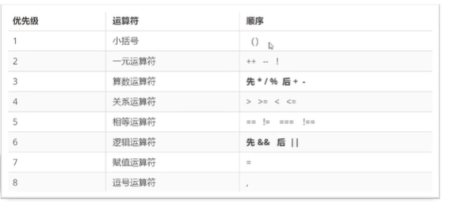
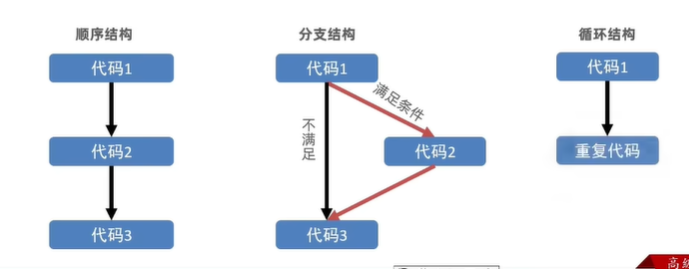
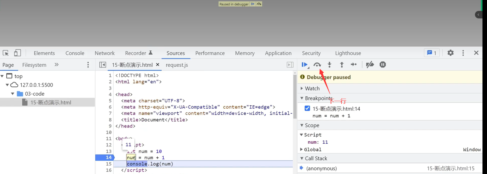

# JavaScript运算符和语句

## 运算符

### 赋值运算符

赋值运算符：对**变量**进行赋值的运算符

```javascript
// 已经学过的运算符
=  		// 将等号右边的值赋予给左边,要求左边必须是一个容器
//其它赋值运算符
+=  自加 
-=  自减
*=  自乘
/=  自除
%=  自取模
```

+= 详解

```javascript
let num = 1
// num+1的一般操作
num = num + 1 
console.log(num)

// 加一的简单写法
// 采取赋值运算符的写法
let n = 1
n += 1
console.log(n)
```

### 一元运算符

JavaScript的运算符可以根据**所需的操作数的个数**，分为一元运算符、二元运算符、三元运算符。

- 二元运算符

  ```javascript
  let num 
  num = 10 + 20  // 二元运算符
  ```

- 一元运算符

  1.自增运算符 ++，让变量的值+1

  

  ---

  **前置自增和后置自增的区别**

  前置自增和后置自增**单独使用没有区别**：不参加**运算和输出**，直接一行自己单独出现。

  ```javascript
  // 以下两种写法一致
  let i =1
  ++i
  console.log(i)  // 输出2
  
  i = 1
  i++             // 后置更加常用
  console.log(i)  // 输出2
  ```

  ```javascript
  // 参加了输出,不是单独运算,结果不同
  let k = 1 
  console.log(k++)   // 输出1
  
  let m = 1
  console.log(++m)  // 输出2
  ```

  参与了运算就有区别(难点)

  - 前置自增，先自加再参加其他**运算和输出**。

    ```javascript
    let i = 1
    console.log(++i + 1)  // 输出结果 3

  - 后置自增，先参加其他运算和输出，才自加1。

    ```javascript
    let i =1
    console.log(i++ + 1) // 输出结果 2,第一部分i先参加其他运算,参加完加法后,i才执行自加操作,变为2,输出结果是2
    ```

---

**总结**

1.只需要一个表达式就可以运算的运算符叫一元运算符

2.自增运算符也是为了简化写法，每次自加1，使用场景是什么？

**经常用来计数，用来计算多少次**

3.<font color=red>实际开发中，使用后置++更多。</font>

### 比较运算符

使用场景：比较两个数据的大小、是否相等等比较



比较运算符有隐式转换，如，会把字符‘2’转变成数字2

```javascript
2 == '2'  // 返回true
2 === '2' // 返回false

Nan == NaN //Nan不等于任何人,包括他自己；返回false
Nan === NaN

 // 双等undefined等于null,所以还是推荐用三等号
console.log(undefined == null)   // 返回true
console.log(undefined === null)  // 返回false
```

**开发中判断是否相等(只要是判断)，强烈推荐使用三等号。**

---

- 字符串也可以比较，比较的是字符对应的ASCII码。

  A的ASCII是65，a的ASCII是97。$65+32=97$

  如果是多个字符串，从第一个开始字符比，若比较出大小结束，相等则比较下一位。（从左到右依次比较）

- NaN不等于任何值，包括他本身

- 尽量不要比较小数，因为小数有精度问题

  

- 不同类型比较，会发生**隐式转换**

  最终会把数据隐式转换成number类型再比较

### 逻辑运算符

使用场景：逻辑运算符用来**解决多重条件判断**

逻辑运算符：



### 运算符优先级

目标：掌握运算符优先级，能判断运算符执行的顺序



小括号>一元运算符(逻辑运算符!在这里)>算术>比较(关系)元素符>相等元素符号>**逻辑元素符&&>逻辑元素||**>赋值运算符

## 语句

### 表达式和语句

表达式：是**可以被求值的代码**，JavaScript引擎会将其计算出一个结果。

```javascript
x = 7
3 + 4
num++
```

语句：是**一段可以执行的代码**

<font color=red>**表达式和语句的区别：**</font>

**表达式**：因为表达式可以被求值，所以他可以写在赋值语句的右侧

**语句**：而语句不一定有值，如alert() for等语句不能被赋值。

某些情况下，也可以把表达式理解为表达式语句，因为它是在计算结果，但不是必须的成分。

### 分支语句

#### 程序三大流程控制语句

顺序结构：从上到下依次执行

分支结构：根据条件选择执行的代码，这叫做分支结构

循环结构：某段代码被重复执行



#### 分支语句

分支语句：可以让我们<font color=red>有选择性</font>的执行想要的代码。

分支语句包含：

- if分支语句
- 三元运算符
- switch语句

##### if分支语句

if语句有三种使用：单分支、双分支、多分支

1.单分支使用方法

```javascript
// 语法
if (条件) {
    满足条件要执行的代码
}
```

- 小括号内条件为true,执行大括号内的代码

- 小括号内结果若不是布尔类型，会发生隐式转换为布尔类型

  空字符串‘’是false,任意非空串true

  数字0是false，任意非0数字true

- 如果大括号是有一个语句，那么大括号可以省略。不提倡

2.双分支if使用方法

```javascript
// 语法
if (条件) {
    满足条件执行的代码
} 
else {
    不满足条件执行的代码
}
```

注意：模板字符串外层的引号是反引号\`${变量名}`

上述代码中，只有一个分支的语句可以被执行，多选一。

3.多分支if语句

使用场景：适合有多种结果的时候，比如学习成绩可以分为：优 良 中 差 

```javascript
// 语法
if (条件) {
    代码1
} 
else if (条件) {
    代码2
}
else if (条件) {
    代码3
}
... // 省略else if
else {
    代码n
}
// 最后一个要以else结尾
```

##### 三元运算符

使用场景：比**IF双分支**更简单的写法，可以使用三元表达式（三元，需要三个操作数）

符号：？与：搭配使用

语法

```javascript
// 一个条件
条件 ？ 满足条件执行的代码 : 不满足条件执行的代码
```

<font color=red>**一般用来取值**</font>

```javascript
// 使用下面的三元表达式取值,赋值给变量num
let num = 3>5? 3:5
```

##### switch语句

switch：翻译过来时开关

```javascript
// 语法
switch (数据) {    //可以跟值、表达式等
    case 值1:
        代码1
        break
    case 值2:
        代码2
        break
          ...    // 省略n个case
    default:
        代码n     //最后一个不用添加break,不会再露下去
}
// 不写break造成的后果是很严重的,会漏下去
```

注意：

- 找到小括号里数据**全等===**的case值，并执行里面对应的代码
- 若没有全等===，则执行default里的代码
- <font color=red>switch语句一般用于**等值判断**，不适合区间判断</font>
- <font color=red>**switch case一般需要配合break关键字使用,没有break会造成case穿透**</font>

### 循环语句

#### 断点调试

作用：更好的理解代码运行，工作时更快的找到bug

方法：浏览器打开调试界面

1. 按F12打开开发者工具

2. 点到sources一栏,pages

3. 选择代码文件

   

#### 循环结构

**循环**：重复执行某些操作

##### while循环

1.**语法**

while：在**满足条件**期间，重复执行某些代码。

```javascript
// 语法
while (循环条件) {
    要重复执行的代码(也称为循环体)
}
```

释义

- 跟if语句很像，都要满足小括号里的条件为true才会进入<font color=red>循环体</font>才执行代码
- while大括号里的代码执行完毕后不会跳出，而是继续返回小括号判断条件是否满足；若满足继续执行大括号代码，然后再回到小括号判断条件，直到括号条件不满足，即跳出。

2.**while循环三要素**

一定要记住，记不住容易写出死循环。

循环的本质就是以某个变量为起始值，然后不断产生变化量，慢慢靠近终止条件的过程。

所以，<font color=red >**while循环需要具备的三要素：**</font>

1. 变量起始值
2. 中止条件（没有终止条件，循环会一直执行，造成死循环）
3. 变量的变化量(在循环体内写，用自增或自减)

---

总结

1.while循环的作用是什么？

在满足条件期间，重复执行某些代码

2.while循环三要素是什么？

- 变量起始值

- 终止条件

- 变量变化量

#### 循环退出

break退出整个循环；continue退出本次循环，继续下次循环。

break 结束了整个循环：后面变量是否变化都不重要了，因为不再执行。

continue：结束本次循环，后面的语句不会再执行；如果变量变化值在continue的后面，还需要再在前面写一个变量变化值，见下例子。

```javascript
        // continue
        let j = 1
        while (j<=5 ) {
            document.write(`我要吃${j}个草莓<br>`)
            if ( j===3 )
            {
               j++      // continue下面的代码不执行,因此前面需要修改值,不然i一直是3,陷入了死循环
               continue // 结束本次循环,下面的代码不再被执行
            }
            j++
        }
```


