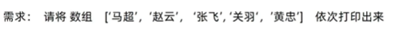
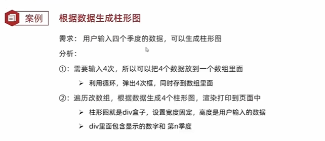
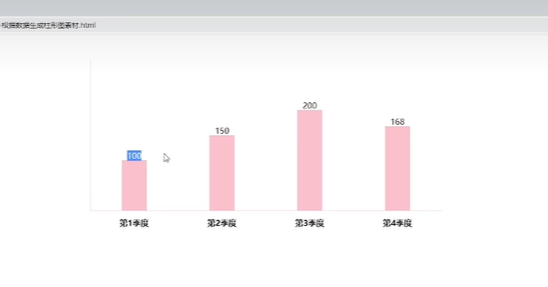
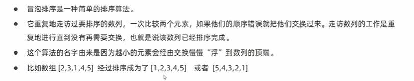
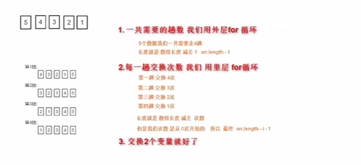

# JavaScript循环for和switch

## if多分支和switch的区别

1.共同点

- 都能实现多分支选择，**多选1**
- 大部分情况下可以互换

2.区别

* switch...case语句通常处理case为比较**确定值**的情况;

  if...else...语句更加灵活，适用于**范围判断**（大于、等于某个范围）

* switch语句进行判断后直接执行到程序的语句，效率更高；

  而if...else语句有几种判断条件，就得判断多少次

* switch一定要注意必须是 **===**全等，一定注意数据类型，同时注意break否则会有穿透效果

* <font color=red>结论</font>

  - 当分支比较**少**时，if...else语句执行效率更高
  - 当分支比较**多**时，switch语句执行效率高，而且结构更清晰

## for循环

### for循环-基本使用

#### for循环语法

while的循环三要素分开写，容易拉下；但是for循环的三要素在一起写，不会拉下。**最常用的循环**

```javascript
// 语法
for (变量起始值；终止条件；变量变化量) {  // 里面的内容就是三要素
    //循环体
}
```

**for循环执行过程**：

变量起始值（永远只执行1次）→判断终止条件→**满足条件执行循环体**→执行变量变化量→判断终止条件→...→不满足终止条件

**<font color=red>for循环的最大价值：循环数组</font>**



#### 退出循环

- continue 退出本次循环，一般用于**排除或者跳过某一个选项时**

  如果在for循环里面遇到continue，直奔for条件里的变量变化量，如i++。（不同于while,不需要在continue前写i++语句）

  ```javascript
  for (let i = 1;i<=5;i++)
  {
  	if (i===3){
  			continue
  			}
  	document.write(`执行${i}次了<br>`)
  }
  ```

- break 退出整个for循环，一般用于结果已经得到，**后续的循环不需要**的时候可以使用

---

**了解**

1.while(true)来构造**无限循环**，**需要使用break退出循环**

2.for(;;)是for的**无限循环形式**

---

#### 小结

1.for循环和while循环有什么区别

- 当明确了**循环的次数**的时候推荐for
- 当**不明确循环次数**的时候推荐使用while

#### 循环嵌套(难点)

1.for循环嵌套 

```javascript
for (外部声明循环次数的变量;循环条件;变化值) {
    for (内部声明循环次数的变量;循环条件;变化值) {
    	//循环体
	}
}
```

**执行过程**：<font color=red>外层for执行一次，里面的for要执行所有次。</font>

## 数组

### 数组是什么

数组：是一种可以按**顺序保存的<font color=red>数据类型</font>**

为什么要数组？<font color=red>如果有多个数据可以用数组保存起来，然后放在一个变量中，管理非常方便</font>

### 数组的基本使用

1.声明数组

```javascript
// 声明数组语法
let 数组 = [数据1,...,数据n]           //字面量声明数组
// 了解
let 数组名 = new Array(数据1,..,数据n) //new Array声明数组
```

2.取值语法

```javas
数组名[小标]
```

3.<font color=red>**遍历数组**(重点)</font>

遍历：从头到尾访问一次，对每个元素进行操作。

方法：用循环把数组中的每个元素都访问到，一般会用for循环

### 操作数组

数组本质是数据集合，操作数据无非是 <font color=red>**增 删 改 查**</font>语法。

1.修改

通过数组加索引号的形式，重新赋值。

```javascript
数组名[下标] = 新值
```

2.**新增元素**

<font color=red>**数组.push()方法将一个或多个元素添加到数组末尾，并返回该数组的新长度（重点）**</font>

```javascript
// 语法
arr.push(元素1,...,元素n)
```

<font color=red>**数组.unshift(新增的内容)**</font> 将一个或多个元素添加到数组**开头**，并返回该数组的新长度。

```javascript
//语法
arr.unshift(元素1,...,元素n)
```

示例

```javascript
let arr = [2,0,6,1,77,0,52,0,25,7]
//注意，声明空数组需要在后面添加[]符号
let arr_new = [] 
for (i=0;i<arr.length;i++){
    if (arr[i]>=10){
        arr_new.push(arr[i])
    }
}
// 输出新数组
console.log(arr_new)
```

3.**删除数组中的元素**

arr.pop()

arr.shift()

arr.splice(操作的下标，删除的个数)

<font color=red>**数组.pop()方法从数组中删除最后一个元素，并返回该元素的值**</font>

```javascript
//语法
arr.pop()    // 括号里面不用写东西;会返回删除的元素值
```


**数组.shift()方法从数组中删除第一个元素，并返回该元素的值**

```javascript
arr.shift()
```


<font color=red>**arr.splice(操作的下标，删除的个数)**</font>

**需求场景**：

1.随机抽奖，中奖的用户就从数组里删除，不允许重复抽奖

2.点击删除按钮，相关的数据就会从商品数据中删除

**后续的课程中会用到删除操作，特别是<font color=red>splice</font>**

```javascript
//splice()删除指定元素,语法
arr.splice(start,deleteCount) 
arr.splice(起始位置,删除几个元素)  
```

注意：

1.起始位置从下标0开始

2.要删除的元素个数，可选的。如果不填，默认是到最后

---

**总结**

1.从末尾删除一个元素用pop,里面不用指定参数

2.从数组开头删除一个元素用shift,里面不用指定参数

3.**想删除数组指定元素用哪个**splice

## 案例（未做）

需求：

效果图：



## 了解冒泡排序





```javascript
let arr = [5, 4, 3, 2, 1]
for (let i = 0; i < arr.length - 1; i++) {          //外层循环终止条件
    for (let j = 0; j < arr.length - i - 1; j++) {  //内层循环终止条件
        if (arr[j] > arr[j + 1]) {
            let temp = arr[j]
            arr[j] = arr[j + 1]
            arr[j + 1] = temp
        }
    }
}
console.log(arr)
```

```javascript
//实际开发中
// sort()默认升序排列
arr.sort()

// sort()降序
arr.sort(function(a,b){
    return b - a
})
```

