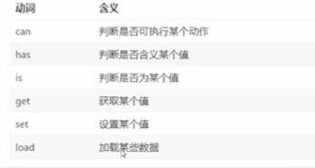
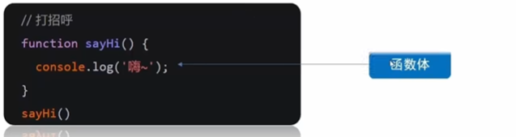
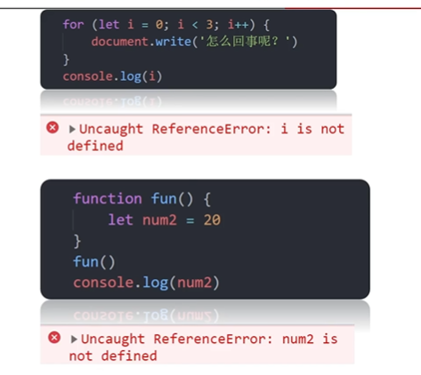
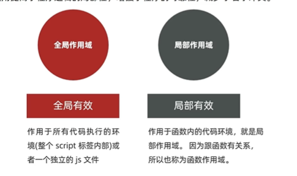
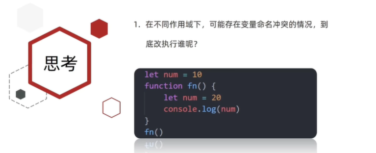
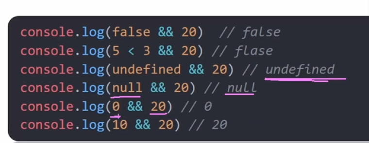
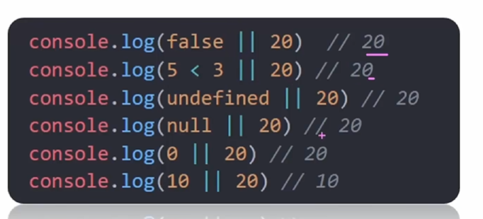
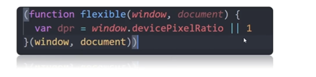
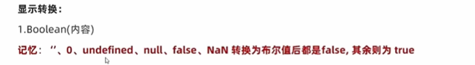
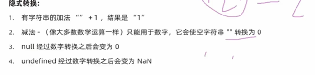

# 函数

## 为什么需要函数？

函数：function,是被设计为**执行特定任务的**代码块

说明：函数可以把具有相同或相似逻辑的代码“包裹”起来，通过**函数调用**执行这些被“包裹”的代码逻辑，这么做的优势是有利于<font color=red>精简代码方便复用</font>

比如我们前面使用的alert()、prompt()和console.log()都是一些js函数，只不过已经封装好了，我们直接使用。

---

1.为什么需要函数？

可以实现代码复用，提高开发效率

2.函数是什么

function执行特定任务的代码块

## 函数使用

**函数的声明语法**

```javascript
function 函数名() {
    函数体     
}
```

**函数命名规范**

1. 和变量命名基本一致

2. 尽量**小驼峰式命名法**

3. **前缀应该为动词**

4. 命名建议：常用动词约定

   

**函数的调用语法**

```
// 函数调用,这些函数体内的代码逻辑会被执行
函数名()
```

注意，声明（定义）的函数必须**调用**才会真正的执行，使用（）调用函数。

**函数体**

函数体是函数的一部分。



---

**总结**

1.函数的声明关键字：function

2.函数不调用不会执行，调用函数方式:函数名()

3.函数的复用和循环重复代码有什么不同？

- 循环代码写完即执行，不能很方便控制执行位置
- 函数随时调用，随时执行，可重复调用

## 函数传参

### 传参基本语法

声明语法

```javascript
function 函数名(参数列表){  //形参
	函数体
}
```

参数列表：

- 传入参数
- 声明这个函数需要传入几个数据
- 多个数据用逗号隔开

调用语法

```javascript
函数名(传递的参数列表)   //实参
// 实参的类型
// 字面量
// 变量
// 变量 = 值的形式
```

调用函数时，**需要传入几个数据就写几个，用逗号隔开**

- 声明括号里面的参数，形参（形式上的参数）

- 调用括号里的参数，实参（实际上的参数）

- **<font color=red>形参可以理解为是这个函数内声明的变量</font>，实参可以理解为给这个变量赋值**

- 开发中尽量保持形参和实参个数一致

- 我们曾经使用过的alert(’打印’)等本质上都是函数调用的传参

---

**总结**

1.函数传参的好处：极大的提高了函数的**灵活性**

2.函数参数可以分为哪两类？怎么判断是哪种参数？

- 实参和形参
- 声明形参，调用实参
- 尽量保持实参和形参的一致

3.参数之间用什么分割？逗号

### 参数默认值

```javascript
function getSum(num1,num2){
    document.write(num1+num2)
}
getSum()  //相当于声明了一点变量没给值，结果是udefined + undefined = NaN
```

因此，如果用户不输入实参，上述的案例会变成NaN的值。**如何解决这个问题？**

改进：如果用户不输入值，那么给<font color=red>形参一个默认值</font>。

```javascript
function getSum(num1 = 0,num2 = 0){  
    document.write(num1+num2)
}
getSum()  //结果是0
// 如果调用时传递了参数,则不会使用默认值;
```

<font color=red>这个默认值只有在缺少实参传递时才会执行，</font>所以**有参数会优先执行传递进来的实参**，否则默认为undefined。

## 函数返回值

- 什么是函数？
  - 函数是**执行特定任务的代码块**。

- 执行完特定任务之后呢？
  - 把任务的结果返回给操作者。

缺点：把计算后的结果处理方式写死了，内部处理了

优点：把处理结果返回给调用者

有返回值函数的概念：

- 当调用某个函数，这个函数会返回一个结果
- 这就是**<font color=red>有返回值</font>**的函数

当然有很多函数没有返回值，所以要根据**需求**，来设定有没有返回值

**返回值语法**

当函数需要返回数据时，用return关键字

```javascript
//语法
return 数据
```

**细节**

- 函数体中使用return关键字能将内部的执行结果交给函数外部使用

- return后面的代码不会再被执行，会立即结束当前函数，<font color=red>return后面的数据不需要换行写</font>

  如果只写一个单独的return 返回值是undefined

- 函数里面可以没有return语句，这种函数会返回undefined

---

**总结**

1.为什么要让函数有返回值

- 函数执行后得到结果，调用者想拿到。也就是说，函数内部不需要输出结果，而是**返回结果**
- 对执行结果的拓展性更高，**可以让其他程序使用这个结果**

2.函数返回使用哪个关键字？注意事项

- 语法：return 数据
- return后面不接数据或者函数内不写return，函数的返回值是undefined
- return能立即结束当前函数，所以return后面的数据不能换行

3.返回值返回给了谁？

- 函数的调用者：函数名(实参)
- let result = 函数名(实参)     //函数返回值给了函数调用者，函数调用者把值给了result

4.发生了错误，去console控制台里面看错误。

5.断点：Sources——Pages点击哪行就在哪里有断点。

- F10下一步(不进入函数体)
- F11会进入函数体

## 函数细节补充

- 两个重名的函数，后面的函数会覆盖前面的函数。

- 在JavaScript中实参的个数和形参的个数**可以不一致**，但是尽量一致

  - 如果形参过多，会自动填上undefined

  - 实参过多，剩余的实参被忽略

    函数内部有一个arguments，里面装着所有实参

- 结束函数可以用return

  break结束和return结束区别？

  <font color=red>return结束函数，break结束循环或switch。</font>

## 作用域

### 基本概念



​	通常来说，一段程序代码中所用的名字并不总是有效和可用的，而限定这个名字的<font color=red>可用性的代码范围</font>就是**作用域**。

​	作用域的使用提高了程序逻辑的局部性，增加了的可靠性，减少了名字的冲突。比如写多个for循环都写i，但是之间不冲突，很好。



- 全局作用域：整个script标签、一个.js文件的全部
- 局部作用域（也称为函数作用域）：函数内部，在某个函数内有效。
  - 块作用域是函数作用域内的一部分。

**根据作用域的不同，变量可以分为：**

- 全局变量：函数外部let定义的变量，全局变量在任何区域都可以修改和访问
- 局部变量：函数内部let定义的变量，局部变量只能在当前函数内部访问和修改

### 变量特殊情况

- 如果在函数内部，变量没有声明直接赋值，**也当做全局变量来看**，**但是强烈不推荐**

  ```javascript
  let num = 10
  function fn(){
      num = 20 //这里是全局变量,全局变量被覆盖了
  }
  fn()
  console.log(num)
  ```

- 函数内部的形参**可以看做函数的局部变量**，出function不能使用

### 总结

1.JS作用域分那两种？

- 全局作用域。函数外部或整个script有效
- 局部作用域。也称为函数作用域，函数内有效

2.根据作用域不同，变量分为哪两种？

- 全局变量
- 局部变量

3.**有一种特殊情况的全局变量是哪种？提倡吗？**

- 局部变量或块级变量 内部没有let声明直接赋值的当全局看

  ```javascript
   //1.不写let
   let num = 10
   function fn() {
       num = 20 //使用前函数未声明,这默认这个是全局变量,全局变量被覆盖了
       console.log(num) 
   }
   fn()
   console.lo
  
   //2.函数内部声明和赋值分开写
   let num2 = 10
   function fn() {
       let num2 = 20
       num2 = 30 // 前面声明了局部变量,这里修改的则是局部变量的值,不影响全局
       console.log(num2)  
   }
   fn()
   console.log
  
   //3.内部声明和赋值同时写
   let n = 10       // 全局变量
   function fn() {
       let n = 20   // 局部变量
       console.log(n)
   }
   fn()
   console.
   
   //4.外部也未声明
   function fn(){
       a = 100   //直接全局变量
   }
   console.log(a) 
  ```

- 不推荐

### 变量访问原则




## 匿名函数

函数分类：

- 具名函数 `function 函数名() {}`
- 匿名函数 `function() {}`

没有名字的函数，没办法直接使用。使用的方式有两种：函数表达式和立即执行函数

### 函数表达式

将匿名函数赋值给一个变量，并且通过变量名的名称进行调用。**称这个方法为函数表达式。**

```javascript
//声明语法
let 变量名 = function(形参列表) { 
    //函数体
}
//调用语法
变量名(实参列表)
```

和具名函数的区别？

- 具名函数定义有提升，具名函数的调用可以在声明之前。
- **函数表达式必须先声明函数表达式，后调用**

函数表达式之后在Web API中用的较多

### 立即执行函数

场景介绍：避免全局变量之间的污染

```javascript
// 方式1
(function(形参){函数体})(实参);
//写法教学
// 1.先写两个小括号,然后填充 ()()
// 2.function(){}写道第一个小括号里面
// 3.然后在上面的大括号中写函数
// 4.立即执行函数须加分号(;)  分号可以加到前面或后面

// 方式2
(function(形参){函数体}(实参));
```

- 第一个小括号里面是形参
- 第二个小括号是调用，里面的参数是实参
- **多个立即执行函数需要分号隔开，要不然会报错**

---

**总结**

1.立即执行函数作用？防止变量污染

2.立即执行函数需要调用吗？注意事项？

- 无需调用，立即执行，其实本质已经调用了
- 多个立即执行函数之间用分号隔开

## 逻辑中断

### 逻辑中断介绍

```java
//为了避免调用出bug,所以这里给了形参默认值
function fn(x = 0, y = 0) {
    console.log(x + y)
}
```

上述方式可以更改为逻辑中断的写法


- 逻辑与，只要左边为假的就中断

  如果内容是判断式，那结果就是布尔型。

  如果是undefined、null等不会转换成布尔型，直接就是该值。

  

- 逻辑或，只要左边为真的就中断

  

```javascript
//另一种避免bug的写法:逻辑中断
 function fn(x, y) {
     x = x || 0     //undefined在逻辑运算中当假看;若为真,直接中断
     y = y || 0
     console.log(x + y)
 }
```

示例，逻辑或中断



### 转换为布尔型

#### 显示布尔转换

```javascript
//显示转换
Boolean()
//在有些判断条件中,会进行隐式转换成布尔类型
```



#### 其他隐式转换总结



注意

- undefine进行**数学操作**都是NaN

- 但是在判断操作中就是True或者False
