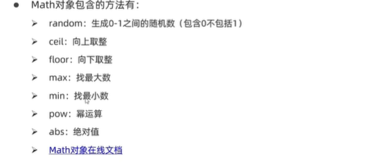
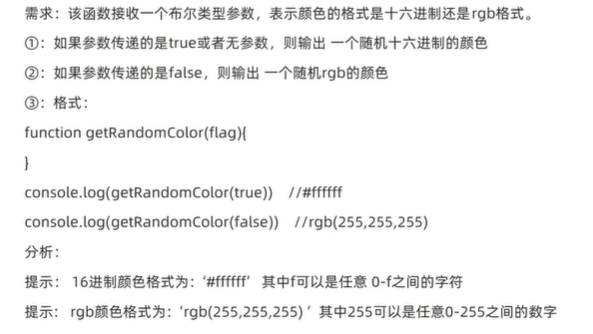
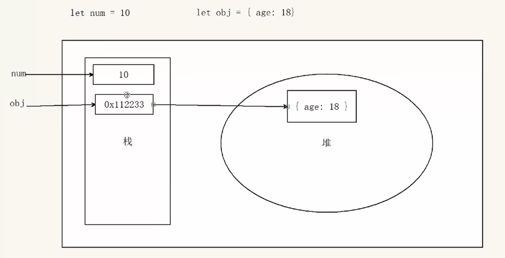
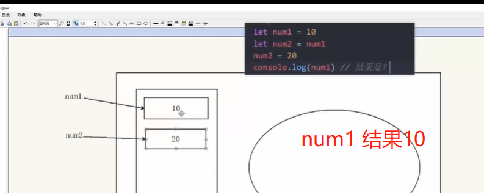
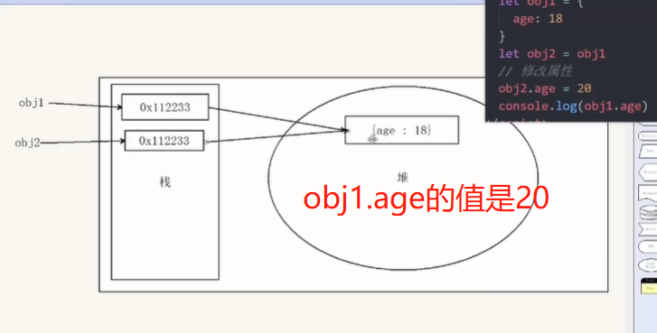

# JavaScript对象

学习目标：

1. 知道对象数据类型的特征，具备**对象数组数据**渲染页面的能力。

## 对象

### 什么是对象

对象是JavaScript里的一种数据类型

可以理解为一种无序的数据集合，**注意数组是有序的数据集合**

用来描述某个事物，例如描述一个人

- 人有姓名、年龄、性别等信息，还有写代码等功能
- 如果多个变量保存则比较散，用对象比较统一

比如描述班主任信息：

- 静态特征：姓名、年龄、身高、性别

- 动态行为：动作唱跳rap,可以使用函数实现

---

**总结**

1.对象是什么

- 数据类型
- 无序的数据集合

2.对象特点

- 无序的数据集合
- 可以详细的描述某个事物

### 对象使用

#### 对象声明

```javascript
let 对象名 = {}
let 对象名 = new Object()
```

对象有**属性**和**方法**组成

- 属性：信息或叫特征（名词）。比如手机尺寸、颜色、重量等...
- 方法：功能或叫行为（动词）。比如手机打电话、发短信、玩游戏...

```javascript
// 有属性和方法的声明
let 对象名 = {
    属性名：属性值, // 注意这里是逗号隔开
    方法名：函数
}
```

- 属性都是成对出现，有属性名和属性值

- 多个属性之间使用英文逗号分割。**不要和CSS的分号混淆**
- 属性可以使用“”或‘’，<font color=red>一般情况下省略</font>，**除非名称遇到特殊符号如空格、中横线等**
- 属性名可以理解为变量

### 对象使用

增删改查

#### 属性

##### 查

方法：对象名.属性

```javascript
// 查某个属性
对象名.属性             //.可以理解为的 对象的属性
```

```javascript
// 查的另外一种写法，规范
对象名['属性名']       //属性名需要加引号
```

**查总结**

1.采取对象名.属性名       简便，属性名无特殊符号建议采用这个

2.采取对象名[‘属性名’]    可以解决**属性名有特殊符号的形式**，例如不会把-解析为减号

##### 改

```javascript
对象名.属性 = 新值
```

##### 增

和改一样，这个在JS里可以，但是在其他语言中无法忍受。

```java
对象名.新增属性 = 值
```

简单来说：就是这个属性如果有，就是改；如果没有这个属性，就是增

##### 删

```javascript
delete 对象名.属性名
```

#### 对象中的方法

- 方法由**方法名**和**函数**两部分构建，他们之间使用:分割
- 多个属性之间用英文,分割
- 方法是依附在对象中的函数
- 使用.调用对象中函数，称之为调用
- 方法可以添加形参和实参
- 大括号内用冒号，大括号外用的等号。外面是赋值操作

```javascript
// 声明
let 对象名 {
	属性:属性值,
    方法名: function(){
     
    },
    方法名:function(形参列表){    //添加形参或实参
    
    }
}
// 方法调用
对象名.方法名()  //注意，不要后面的括号
```

```javascript
// 声明
let person = {
    name : 'andy',
    sayHi : function(){
        document.write('Hi~~')
    }
// 对象调用
person.sayHi()  //不要忘记括号

// 注意,不要使用以下形式输出
// 因为这个函数没有返回值,则默认返回undefined,打印输出的结果是undefied
console.log(person.sayHi())
```

对象外面叫函数，对象里面叫方法。

注：函数没有return则返回underfined。程序使用的都是函数的返回值

### 遍历对象

能够遍历输出对象中的元素

注：**对象是无序的键值对，没有规律也没有长度，不能使用for+索引号的形式**。从键值对入手


```javascript
for (let k in obj):
	{
        console.log(k)     //属性名,字符类型。
        console.log(obj[k]) //属性值
        
    }

// 举例
let obj = {
    uname : 'pink',
    age : 18,
    gender : '男'
}
// 遍历对象
for (let key in obj){
    console.log(key)      // 属性名,字符串类型的
    console.log(obj.key)  // 错误，相当于obj.'uname' 在.后添加了引号,实际使用不添加引号。会返回underfined
    console.log(obj[key]) // 正确
}

```

<font color=red>k获得的是对象的属性名，对象名[k]获得属性值</font>


```javascript
// 其他 let k in 类型详解 
let arr = ['blue','red','pink']
for (let k in arr){
     console.log(k)       // k是字符串类型的数组下标值
     console.log(arr[k])  // 开发中很少使用k方法遍历数组，因为k是字符串类型  
}

// 数组遍历正确方法
for (let i=0;i<arr.length;i++){
    // 内容
}
```

---

补充

```javascript
teypof null   // 返回object
let obj = {}  // 等于 null,定义未声明则为object
```


### 内置对象

#### 介绍

学会使用JavaScript为我们准备好的内置对象

- <font color=red>什么是内置对象</font>

  JavaScript内部提供的对象，包含各种属性和方法给开发者使用

  如doucument.write()、console.log()打印方法

- 内置对象**Math**

  是JavaScript提供的一个数学对象，提供了一系列数学运算的方法

  

#### 内置函数案例

1. 生成任意范围的随机数

   ```javascript
   Math.random() // 随机返回[0,1)之间的小数，不包括1，左闭右开
   ```

2. 0-n之间的随机数

   ```javascript
   Math.floor(Math.random() * (n + 1)) 
   // 0-10之间的随机数
   Math.floor(Math.random() * (10 + 1)) 
   
   ```

3. 随机抽取数组中的元素

   ```javascript
   // 取任意数组中的值
   Math.floor(Math.random() * arr.length)
   ```

4. 生成m-n之间的随机数

   ```javascript
   Math.floor(Math.random()*(n-m+1))+ m // 先生成n-m+1个数,即0至n-m+1,然后在平移m个
   // 5-10之间的随机数
   Math.floor(Math.random()*6) + 5
   ```

#### 随机数案例

1. 随机点名数组内

   - 点名允许重复arr[random]
   - 不允许重复splice(ramdom,1)

2. 猜数字

   

   - 不指定猜测次数 使用while循环，允许玩家重复提交直至猜对。注意猜对了的退出条件，不然死循环

   - 指定猜测次数 使用for(let i =1;i<=n,i++) 猜到三次结束。

     注意设置flag开关变量，若三次没猜对提醒用户次数用完。

3. 生成随机颜色

   

   

   没有直接返回字符的函数，但是可以通过数组作为媒介实现。随机返回数组中的值，用数组中的值。

   ```javascript
    // 1.自定义随机颜色函数
    function getRandomColor(flag) {
        // 3.如果是true,返回#ffffff
        if (flag) {
            let arr = ['0', '1', '2', '3', '4',
                '5', '6', '7', '8', '9', 'A', 'B', 'C', 'D', 'E', 'F']
            // 定义6个太麻烦，循环，每次抽一个循环字符串拼接
            str = '#'
            for (let i = 1; i <= 6; i++) {
                let random = Math.floor(Math.random() * arr.length)
                str = str + arr[random] //注意这里是random,随机生成的数组索引号
            }
            return str
        }
        else {
            // 4.否则是flase,返回rgb(255,255,255)
            let r = Math.floor(Math.random() * 256)
            let g = Math.floor(Math.random() * 256)
            let b = Math.floor(Math.random() * 256)
            return `rgb(${r},${g},${b})`
        }
    }
    // 2.调用函数getRandomColor(布尔值)
    console.log(getRandomColor(true))
   ```

   

## 案例


## 其他补充

 ### 术语解释


### 基本数据类型和引用数据类型

目标：了解基本数据类型和引用数据类型的存储方式

- 简单类型、基本数据类型、值类型

  在存储时，变量中存储的是值本身，因此叫做值类型

- 复杂类型又叫做引用类型。

  在存储时变量中存储的**仅仅是地址（引用）**，因此叫做引用数据类型

  通过new关键字创建的对象（系统对象、自定义对象）都是引用类型，如**object/array/date**

---

堆栈空间




栈（操作系统）：简单数据类型存放在栈中

堆（操作系统）：引用数据类型存储在堆中

案例：



​		只要声明，**就会开辟自己在栈的内存空间**，只不过内存空间存储的内容**可能是值也可能是地址**。如果是地址，就会改变。



是同一个地址，所以是会共同改变这个值。


​		


