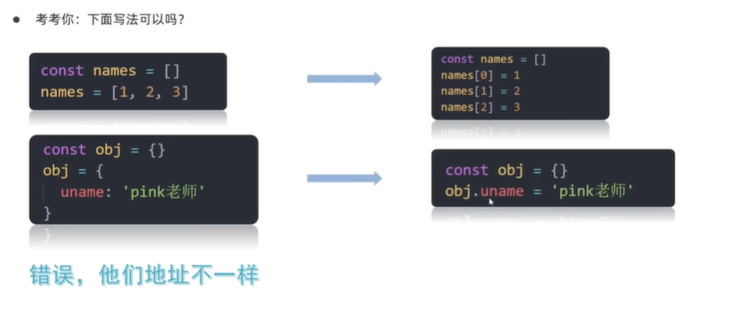
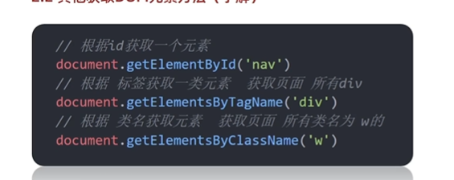
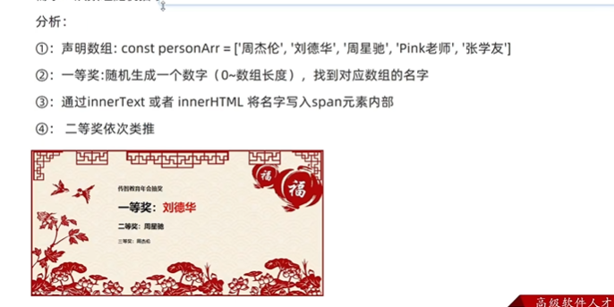

# DOM获取元素

## 变量声明const

变量声明：var、let、const应该用哪个？

排除var，已经被淘汰了。

建议优先用const，尽量用const，原因是：

- const语义化更好
- 实际开发中，react框架中，基本const

如果还在纠结，建议：

- 有了变量先给const，如果发现它后面要修改，再改为let
- <font color=red>建议数组和对象使用const来声明</font>

举例：


基本数据类型只要后续在发生赋值操作，更改了值，就不可以用const。


引用类型更改数据，改变的是堆里的内容，栈内存储的内存地址不发生改变。

```javascript
const arr = ['pink','red']
        arr.push('blue')          // 可以添加，不报错。没改变原来的值
        console.log(arr)

        arr = [1,2,4] // 会报错，开辟了新数组
// 第二种方法会报错,因为开辟了一个新的数组。而不是在原来数组的基础上增删改查
```



---

**总结**


## Web API基本认知

### 作用和分类

作用：就是用JS去操作html和浏览器

分类：DOM（文档对象模型）、BOM（浏览器对象模型）


### 什么是DOM

DOM（Document——文档对象模型）是用来呈现以及与任意HTML或XML文档交互的API。

白话文：DOM是浏览器提供的一套用来**操作网页内容**的功能，**让网页元素发生变化**

DOM作用：开发网页内容特效和实现用户交互

### DOM树

DOM树是什么

- 将HTML文档以**树状**结构直观的表现出来，我们称之为文档树或DOM树

- 描述网页内容关系的名词

- 作用：<font color=red>文档树直观的体现了标签与标签之间的关系</font>

  

### DOM对象（重要）


DOM树的内容在html中叫标签，在JS里面叫对象。

DOM核心思想：把网页内容当做**对象**来处理

document对象

- 是DOM里提供的一个**对象**

- 所以它提供的属性和访问都是**用来访问和操作网页内容的**

  例如document.write()

- 网页所有内容都在document中

  


## 获取DOM对象

简单理解：把标签抓过来。如果想修改就需要先获取

目的：能够查找/获取DOM对象

### 根据CSS选择器来获取DOM元素（重点）

#### 选择匹配的第一个元素

```javascript
// 语法
const 变量名 = document.querySelector('css选择器')  //页面所有内容的都在document中,所以要先写document
// 注意
// css选择器的内容，在css里面怎么写，在上面就怎么写
// 一定要添加引号
```

返回值：上述CSS选择器匹配**第一个元素**，一个HTMLElement对象。

如果没匹配到，返回空

```javascript
console.log(返回对象变量名) // 打印的是元素的网页内容,html
console.dir(返回对象变量名) // 打印的是js对象
```

#### 选择匹配的全部元素

```javascript
document.querySelectorAll('css选择器')
```

参数：包含一个或多个有效的CSS选择器 **字符串**

返回值：CSS选择器匹配的**NodeList 对象集合**（数组形式，伪数组）


得到是一个<font color=red>伪数组</font>：

- 有长度有索引号的数组
- 但是没有pop() push()等数组方法

想要改变样式，需要遍历for循环方式修改每个的内容。

哪怕元素内容只有一个，返回的只有一个，得到的也是伪数组形式。


---

**总结**


### 其他获取DOM元素的方法（了解）



注意，上面的获取里面不写id选择器#号、类选择器的.符号。

不如上面方便，上面的一个查询里面可以写很多种类型。

## 操作元素内容（文本内容）

拿过来DOM对象之后，就需要进行操作。**修改元素的文本更换内容**。


### innerText

- 将文本内容添加/更新到任意标签位置
- 不解析html标签，会识别为文本。

### innerHTML

- 将文本内容添加/更新到任意标签位置
- 解析html标签，多标签建议使用模板字符串

### 年会抽奖案例



## 操作元素属性（常用属性、样式、表单）

### 操作标签常用属性

- 通过JS设置/修改标签元素属性，比如通过src更换图片
- 最常见的属性如：href/title/src

```javascript
// 语法
对象.属性 = 值
// 示例:刷新修改图片

<script>
    // 随机取n-m的数字
    function getRandom(n, m) {
        return Math.floor(Math.random() * (m - n + 1) + n)
    }
    // 1.获取图片对象
    const img = document.querySelector('img')
    // 2.随机得到序号
    const random = getRandom(1, 6)
    // 3.更换路径
    img.src = `./images/${random}.webp`
    img.title = 'abc'
</script>
```

### 操作元素样式属性（重要）

通过JS设置/修改标签元素的样式属性

- 比如轮播图小圆点自动更换颜色样式
- 点击按钮可滚动图片，这是移动的图片的位置left

学习路径：

1. <font color=red>通过style属性操作CSS</font>

   缺点：每个属性都要单独书写一行，太长，繁琐

2. 操作类名（className)操作CSS

   适用于修改较多的属性，比较方便。

   缺点：会覆盖掉原先的类名，所以使用时还要先检查标签是有类名

3. 通过classList操作类控制CSS

   解决className容易覆盖以前类名的问题，可以通过classList方式**追加和删除类名**

#### 通过style属性操作CSS

```css
/*CSS中style属性修改样式的方法*/
<style>
选择器 {
    属性:属性值;
    ...
    属性:属性值;
}
</style>
```

```javascript
// JS中语法
对象.style.属性 = ''  // 一般都需要加''
// 注意:在CSS style中属性若是用-符号链接,JS中则去掉-符号采用小驼峰写法
```

**总结**


```javascript
// 示例
<!DOCTYPE html>
<html lang="en">

<head>
    <meta charset="UTF-8">
    <meta http-equiv="X-UA-Compatible" content="IE=edge">
    <meta name="viewport" content="width=device-width, initial-scale=1.0">
    <title>Document</title>
    <style>
        body {
            background: url(./images/desktop_1.jpg) no-repeat top center;
        }
    </style>
</head>

<body>
    <script>
        // console.log(document.body)
        // console.dir(document.body)
        // 可以直接用document.body而无需获取

        // 随机取n-m的数字
        function getRandom(n, m) {
            return Math.floor(Math.random() * (m - n + 1) + n)
        }
        const random = getRandom(1,10)
        // 不要忘记写style 要书写style
        document.body.style.background = 		`url(./images/desktop_${random}.jpg) no-repeat top center `
    </script>
</body>
</html>
```

#### 操作类名（className）修改CSS

- 如果修改样式较多，直接通过style属性修改比较繁琐，可以通过**借助于CSS类名**的形式。

  <font color=red>CSS和JS的配合</font>

- 语法

  含义：为该元素标签添加一个类active的样式。(在html标签中不使用class=‘类名’形式添加,而是通过JS，JS等于上述效果。审查网页元素时，显示出的效果和在html标签中相同)

  ```javascript
  // active是一个css类名,不需要.符号
  JS元素标签名.className = 'active'
  ```

- 注意

  1. 由于class是关键字，所以使用className去代替

  2. className是使用新值<font color=red>换</font>旧值，如果需要添加一个类，需要保留之前的类名。

     保留就是在 等号右侧同时书写上原来的类名,使用空格分隔多个类名

---

**总结**

1. 使用className有什么好处？

   可以同时修改多个样式。

2. 使用className有什么注意事项？

   直接使用className复制会**覆盖**以前的类名

#### 通过classList操作类控制CSS

- 解决className容易覆盖以前类名的问题，可以通过classList方式**追加和删除类名。**

- 语法

  ```javascript
  // 追加一个类
  元素.classList.add('类名')
  // 删除一个类
  元素.classList.remove('类名')
  // 切换一个类:有就删掉，没有就添加
  元素.classList.toggle('类名')
  ```

  注意：上面的元素是通过JS获取得到的JS对象，而不是单单的html标签名

---

**总结**

1. 使用className和classList的区别？
   - className修改大量样式的更方便
   - classList修改不多样式更方便
   - classList是追加和删除不影响以前的类名


#### 随机轮播图案例


---

**总结**


1. **常用属性**直接在标签后面写.属性

2. style操作**样式属性**JS后先写.style.样式属性 = xxx

3. className操作样式属性：JS对象.calssName = xxx 类名
4. classList操作样式属性：JS对象.classList.方法名(‘’)

### 操作表单元素属性

- 表单很多情况，也需要修改属性，比如点击眼睛，可以看到密码，**本质是把表单类型转换为文本框**

- 和其他标签属性没有任何区别

- **修改方式**

  获取：DOM对象.属性名

  设置：DOM对象.属性名 =  属性值

注：表单不通过innerHTML获得文本内容，而是通过value

``` javascript
表单对象.value                 // 得到表单值
表单对象.value = '新的属性值'    // 修改表单值
表单对象.type = 'password'      // 新的类型:password
```

- 表单属性中添加就有效果，移除就没有效果，一律使用布尔值表示。如果为ture代表添加该属性，如果是false代表移除该属性

- 比如：disabled、checked、selected

  ```javascript
  disabled : true    // 按钮不能点击,默认false:不禁用按钮
  checked  : true    // 代表按钮被选中画√
  
  
  // 注
  表单对象.checked = 'ture'  // 这样表单也会被勾选,'true'会发生字符串隐式转换,变为true。只有空串是false
  ```

### H5自定义属性

标准属性：标签天生自带的属性，可以直接使用语法操作，如disabled，checked，selected

自定义属性：

- 在html5中推出来了**专门的data-自定义属性**

- 添加方式：在标签上一律以data-开头，<font color=red>看到以data开头的，全是自定义属性</font>

- 获取方式：在DOM对象上一律以dataset对象方式获取

  js对象.dataset.自定义属性


## 定时器-间歇函数

下面这个模块每秒变化一次：


- 网页中经常需要一种功能：每隔一段时间需要<font color=red>自动</font>执行一段代码，不需要手动触发。

- 例如：网页中的倒计时，每隔1s重新运行一次
- 实现方式：需要定时器函数，定时器函数有两种：
  - 间歇函数
  - 延时函数

定时器函数可以开启和关闭定时器。

### 开启定时器setInterval

```javascript
setInterval(函数，间隔时间)
// 一般里面使用匿名函数
```

作用：每间隔多少时间，调用一次这个函数

间隔时间单位是毫秒,1s=1000ms


### 关闭定时器clearInterval

在某些情况下，定时器需要结束。比如鼠标点击

每个定时器返回的数字都是独一无二的，这 样页面的各个定时器不会冲突。


### 小结


## 综合案例


轮播图内容每隔1s自动切换。
