# Web APIs DOM事件基础

## 事件监听（事件绑定）

### 事件

- 什么是事件？

  事件是编程时在HTML内发生的**动作**或发生的事情

  比如用户在网页上**单击**一个按钮

- 什么是事件监听？

  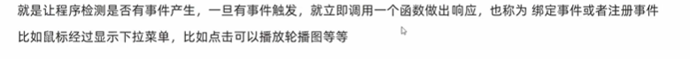

### 事件监听语法

```javascript
元素对象.addEventListener('事件类型',要执行的函数)
```

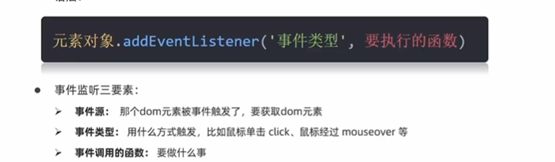

注意：不是任何时候都执行要执行的函数，事件发生才会调用要执行的函数

举例：


- 事件类型要**加引号**
- <font color=red>函数是点击之后再去执行，每次点击都会执行一次</font>

### 小结

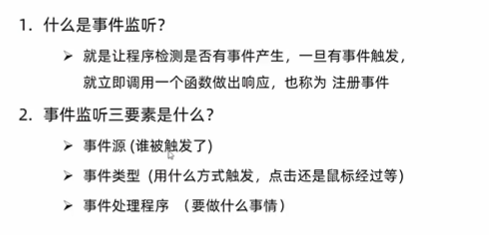

### 事件监听版本

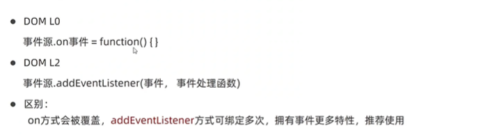

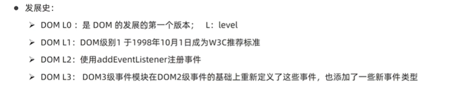


## 事件类型

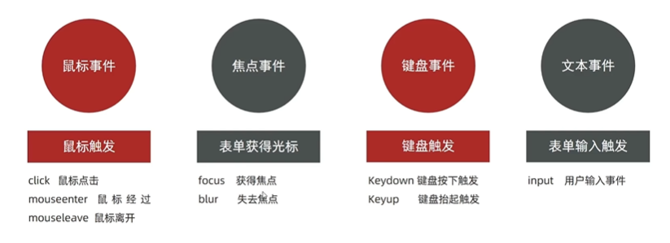


### 鼠标触发

- click 鼠标点击
- mouseenter 鼠标经过
- mouseleave鼠标离开

JS也可以自动调用点击事件，效果和用户点击相同。

```javascript
// JS产生点击效果
元素JS对象.click()
```

### 表单获得光标

- focus
- blur

### 键盘触发事件

- keydown 键盘按下触发

- keyup 键盘抬起触发

### 用户输入文本事件

- input 严格来说是文本框的内容发生改变

  

## 事件对象

### 获取事件对象

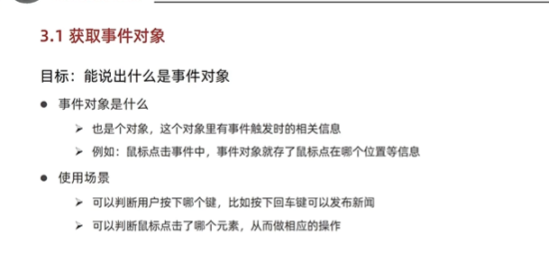

### 获取事件对象语法

- 在事件绑定的回调函数的**第一个参数**就是事件对象
- 一般命名为event,ev,e

```javascript
元素.addEventListener(事件类型,function (e) {
    // 函数体
})
```

只有在addEventListener中的执行函数的第一个形参才是事件对象，不在这个里面的第一个参数都只是普通形参。

- 部分常用属性
  - type：获取当前的事件类型
  - clientX/ClientY：获取光标相对于浏览器**可见窗口左上角**的位置
  - OffsetX/OffsetY：获取光标相对于当前**DOM元素左上角**的位置
  - key：用户按下的键盘键的值，现在不提倡使用keyCode

### 案例：按下回车评论发布

建议使用keyup,因为有人喜欢按着不松手,那么会一直执行keydown

见15-评论回车发布.html


## 环境对象

目标：能够分析判断函数运行在不同环境中**this所指代的对象**

**环境对象**：指的是函数内部特殊的<font color=red>变量this</font>，它代表**当前函数运行时所处的环境**。每个函数都有this 

**简单来说**，谁调用函数指向谁

**作用**：**弄清楚this的指向，可让代码更简洁**

- 函数的调用方式不同，this指代的对象也不同
- <font color=red>【谁调用，this就是谁】</font>是判断this指向谁的策略规则

---

**总结**

1. 环境对象this是什么？

   代表当前函数运行时所处的环境

2. 判断this指向谁的粗略规则是什么？

   <font color=red>谁调用，this就是</font>

3. this的用处?

   可以让代码更简洁

## 回调函数(名词)

如果函数A作为参数传递给函数B时，称函数A为**回调函数**。

注意：回调函数作为参数时，若在参数中定义则按正常格式写function (){}；若在其他地方声明，此处调用不需要写()，只需要写函数名。

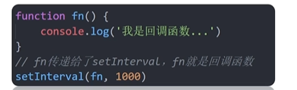

- fn是回调函数
- 什么时候调用？过了一秒钟调用

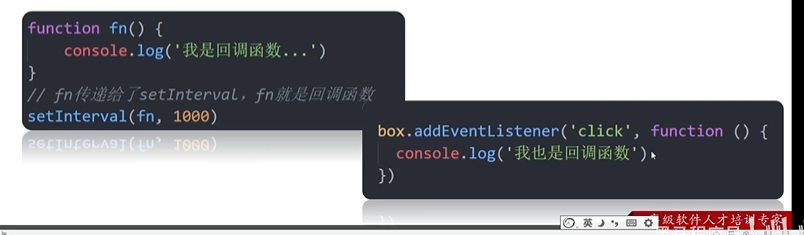

- 监听函数里面的执行函数也是回调函数

  不会立即执行，只有当事件类型发生时，才会产生回掉。

---

**总结**

1. 回调函数
   - 把函数当做另一个函数的参数传递，这个函数就叫回调函数
   - 回调函数本质还是函数，只不过把它当成参数使用
   - 使用**匿名函数**作为回调函数比较常用


## 案例

### 随机点名案例

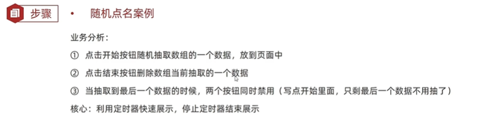

### 输入字数统计

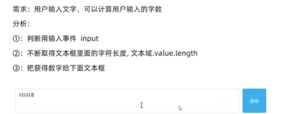

见7-Web APIsDOM基础，13-评论回车发布

```css
/* CSS实现输入框样式变化,而不是JS*/
/* 注意transion是设置过度效果*/
<style>
    input {
        width: 200px;
        transition: all 0.3s; /* 设置过度效果 长度慢慢改变,所有属性在0.3s内慢慢改变*/
    } 

    /* 伪类选择器实现样式变化 */
    input:focus {
        width: 300px;
    }
</style>
```

## 综合案例


注意：

1.hover和mouseenter区别

- hover在鼠标悬停时存在、鼠标离开自动消失；

* mouseenter鼠标经过时发生变化、鼠标离开保持鼠标经过的状态，不变。（除非写mouseleave）
