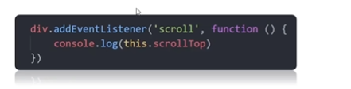
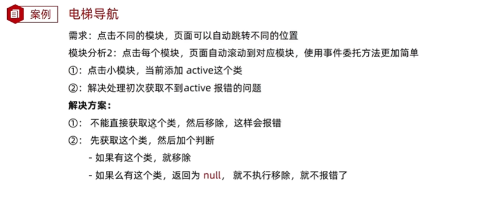

# Web APIs DOM事件进阶:事件流

## 表单复选框案例


案例1：当选中“全选”框时，下面的按钮要全部选中；当取消“全选”时，下面的按钮要全部取消。(大控制小)

案例2：当下面的小按钮选中的数量===3时，上面的”全选框“要选中；不===3，上面的”全选框“要不选中。（小控制大）


## 事件流与两个阶段说明

- **事件流**指的是事件完整执行过程的**流动路径**。事件流有两个阶段。

  

### 事件捕获


如果对多个**嵌套盒子都注册了同一种点击事件**，那么在捕获阶段：执行的过程中，从大到小执行。

### 事件冒泡

目标：能够说出事件冒泡的执行过程

**事件冒泡的概念**：当一个元素的事件被触发时，同样的事件将会在该元素的所有祖先元素中依次被触发。这一过程称为事件冒泡。

**简单理解**：当一个元素触发事件后，会依次向上调用所有父级元素的<font color=red>同名事件</font>。

### 阻止冒泡


stopPropagation()是阻止的事件传播，因此也可能阻止冒泡或捕获

### 解绑事件

事件一旦绑定了在某些情况下可以解除。

#### L0：on事件方法


#### L2：remove方法


### 鼠标经过事件的区别

- mouserover和mouseout会有冒泡效果
- mouseenter和mouseleave没有冒泡效果(推荐)

### 两种注册时间的区别


## 事件委托

### 事件委托知识点

事件冒泡可以做事件委托。

**委托场景**：班里所有学生订了快递，快递小哥把快递送给班主任，班主任把快递转交给各个学生。**有时候有些事件不需要亲自执行，而是交给父亲执行。**

**事件委托**：事件委托是利用<font color=red>事件流的特征</font>解决一些开发需求的知识技巧。

- 优点：减少注册次数，可以提高程序性能

- 原理：事件委托是利用事件冒泡的特点。

  - 给<font color=red>父元素注册事件</font>，当我们触发子元素时，会冒泡到父元素身上，从而触发父元素事件。

    

    上图中：点击小li，触发点击事件，但是小li没有时间执行函数；事件冒泡到父元素身上，因此父元素ul执行点击事件。

  - 实现：事件对象.target.tagName 可以获得真正触发事件的元素

    target触发事件元素JS对象，在JS对象上进行操作

    tagName触发事件的元素对象的**名字**，用来进行if判断

---

**总结**

1. 事件委托的好处是什么？

   减少注册次数，提高程序性能

2. 事件委托是委托给了谁？父元素

3. 如何找到真正触发的元素标签？

   - 事件对象名.target.tagName,用来判断

   - 真正触发事件的对象：对象名.target

### 事件委托案例

使用事件委托实现：

- 鼠标点击，tab栏 红色文字和红色底线的效果切换
- 点击tab栏后，下面的内容区域也发生变化。


任务1：事件委托实现鼠标点击tab栏切换

```javascript
// 核心代码
// 事件委托给父级元素
const ul = document.querySelector('ul') 
// 排他思想
ul.addEventListener('click',function (e){
    // 判断是否为点击的小a标签 (click 点击到的是最小的)
    if (e.target.tagName === 'A'){
    	// 1.别人移除
    	document.querySelector('.active').classList.remove('active') // 注意：第二个不添加.
    	// 2.自己添加
   		e.target.classList.add('active')
})
```

任务2：事件委托实现内容栏随着tab栏切换的功能

关键技术：

- 自定义属性data-id手工输入索引号，实现上下两个区域内容对应,

- 在html标签中，<data-id=‘数值’>

  在Js中获得属性的方式，JS对象名.dataset.id

### 阻止默认行为

**在某些情况下**需要阻止默认行为的发生，比如 阻止链接的跳转、表单域跳转。

之前学的是阻止冒泡

```javascript
e.preventDefault() // 阻止默认行为
```

---

**小结**

```javascript
// 阻止冒泡
事件对象.stopPropagation()
// 阻止元素默认行为 e事件对象,事件处理函数第一个参数
e.preventDefault() 
```

## 其他事件

除了鼠标点击、经过、离开、光标、表单输入、键盘按下抬起外的其他事件。

目标：掌握新的事件，做更强的交互。

### 页面加载事件

#### load事件：全部web资源加载完毕

一般来说，代码从上往下按照顺序执行。

- **外部资源（如图片、外联CSS和JavaScript等）加载完毕**时触发的事件。

- 为什么要学？

  - 有时候需要等页面资源全部处理完了再做一些事情
  - 老代码喜欢把script写在head中，这时候直接找dom元素找不到。（因为代码是按照顺序执行，script在上面，下面的dom还没加载）

- 事件名、事件类型：load

- **监听页面所有资源加载完毕**

  - 给window添加load事件。window事件源

    ```javascript
    // 页面加载加载
    window.addEventListener('load',function(){
        // 页面资源全部加载完毕执行的操作
    }
    )
    ```

- 注意：不光可以监听整个页面资源加载完毕，**也可以针对某个资源绑定load事件**。

<font color=red>事件处理函数不是立即执行的，而是事件触发了才会执行。</font>

#### DOMContentLoaded：HTML文档资源加载完毕 

- 当初始的<font color=red>HTML</font>文档被完全加载和解析完成之后，DOMContentLoaded事件被触发，而无需等待样式表、图样等完全加载。

- 优点：HTML标签加载更快，不需要等待别的即可执行

- 事件名：DOMContentLoaded

- 监听页面DOM加载完毕

  - 给document添加DOMContentLoaded事件

    ```javascript
    document.addEventListener('DOMContentLoaded',function(){
        // DOM资源加载完毕后的执行函数
    })
    ```

---

**小结**

1.页面加载事件有哪两个?如何添加？

- load

  监听整个页面资源给**window**添加

- DOMContentLoaded

  给**document**添加

  无需等待样式表、图像等完全加载

### 页面滚动事件

- **滚动条在滚动时候持续触发的事件**（持续）

- 为什么要学？

  很多网页在检测用户把页面滚动到某个区域后做一些处理，比如固定导航栏，比如返回顶部

- 事件名：scroll

- 监听整个页面滚动

  ```javascript
  // 页面滚动事件
  window.addEventListener('scroll',function(){
      // 页面滚动时执行的操作
  })
  ```

  - 给window或document添加滚动事件，习惯了给window加

- **监听某个元素的内部滚动**直接给某个元素加即可(滚动得有滚动条)

- 使用场景：

  - 想要页面滚动一定元素，就让某些元素做某些事（有意义的事）
  - 显示隐藏，怎么知道页面滚动了多少像素

- JS对象新属性：scrollLeft和scrollTop属性

  - 获取被卷去的大小

  - 获取元素内容往左、往上滚出去看不到的距离

    scrollTop:拉动滚动条，元素向上走的距离

  - 这两个值是<font color=red>可读写的</font>：不仅可以写，还可以赋值

    

- 尽量在scroll事件里获取被卷去的距离

  

  ​     写到外面页面一打开永远是0,不会发生改变

- 开发中，我们经常检测页面滚动的距离，比如页面滚动100像素，就会显示一个元素或者固定一个元素

  - 补充：页面最大的元素是html标签

    ```javascript
    // 获得html标签的方法
    document.documentElement
    ```

  - 代码

---

**小结**


### 页面尺寸事件

- 会在窗口尺寸改变的时候触发事件

- 事件名称：resize

  ```javascript
  window.addEventListener('resize',function(){
      // 执行的代码
  })
  ```

- <font color=red>获取宽高：</font>

  - 获取元素的可见部分宽高（不含边框，margin，滚动条等，包含内容区域和padding）

    

  - <font color=red>clientWidth和clientHeight</font>

### 元素的尺寸与位置


#### 获取元素宽高

- 获取元素的自身宽高，包含元素自身设置的宽高、padding、border
- offsetWidth和offsetHeight
- 获取出来的是数值，方便计算
- 注意：获取的是**可视宽高**，如果盒子是隐藏的，获取的结果是0

#### 获取元素位置

- 获取元素距离自己**定位父级元素**的左、上距离。如果没有父亲或父亲没有定位，就一级一级向上找。
- <font color=red>offsetLeft和offsetTop，注意是只读属性</font>

---

**总结**

1. offsetWidth和offsetHeight得到元素什么的宽高？

   内容+padding+border

2. offsetTop和offsetLeft得到的位置以谁为准？

   - 带有定位的父级
   - 如果都没有，则以文档左上角为准


https://www.bilibili.com/video/BV1Y84y1L7Nn/?p=113&spm_id_from=pageDriver&vd_source=dde2f4dd432156027fedf9b1734ba705

bilibili案例没看

### 综合案例

业务需求和内容如下：


实现方法，为了避免各个部分污染，因为可以放到不同的模块中做。：


方法：立即执行函数

模块2遇到的问题，使用了一个if条件判断



```javascript
// 排他思想,这里很特别：因为一开始没有active类,需要条件判断一下才可以
const old = document.querySelector('.xtx-elevator-list .active') // 找不到返回null
// 判断：如果原来有类就移除，如果开始没有类，就不删除，所以不报错
if (old) old.classList.remove('active')
e.target.classList.add('active')
```

模块2解决方法：

其他Bug修复：

- 顶部模块跳转上去,回来发现有高亮，按道理来说，最后一个小a不参加
- 点击导航栏，页面跳转：想让页面是滑动过来的，而不是直接跳转到的

模块3分析：

- 刚才设置的是小盒子导航控制大盒子，现在需要页面滚动到大盒子位置，电梯导航小盒子对应模块自动处于选中状态。

- 补充：属性选择器

  ```css
  标签名[属性名]        /* 选择含有特定属性的标签 */
  标签名[属性名=属性值]  /* 选择属性＝特定属性值的标签*/
  ```

  如果标签多个自定义属性，怎么获得？

  ```html
  <input type='text' data-id='1' data-name='pig'>
  <script>
  标签名.dataset                // 会返回所有自定义属性的集合 对象形式
  标签名.dataset.自定义属性具体名 // 返回某一个自定义属性
  </script>
  ```

  


