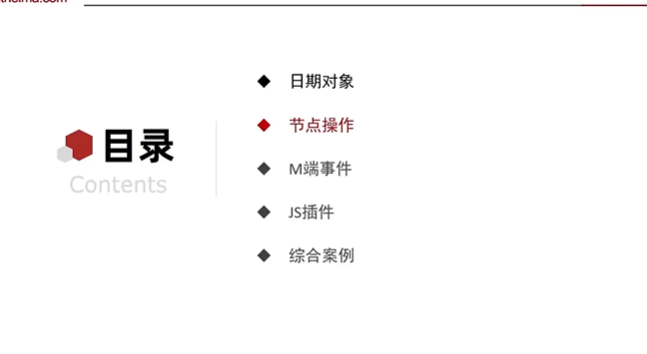
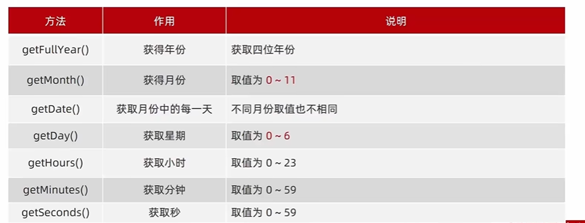
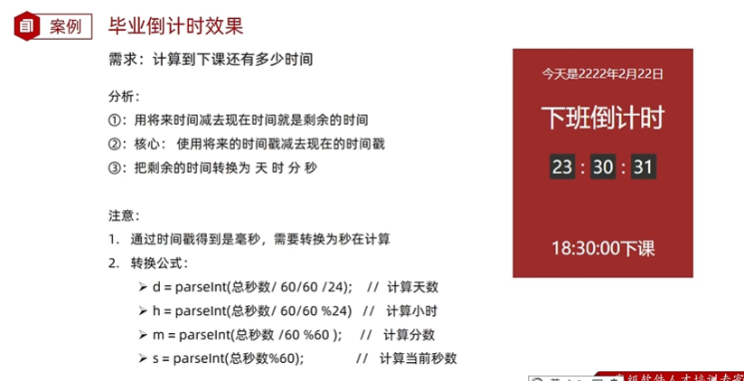
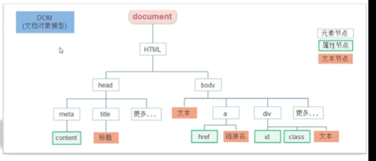
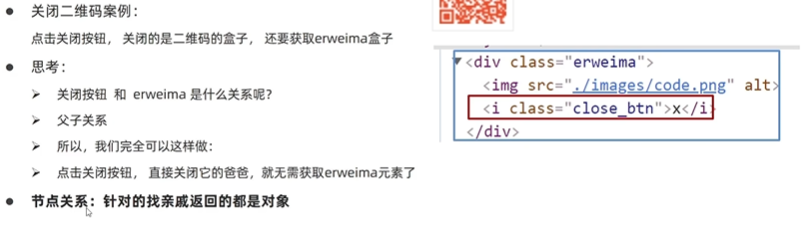
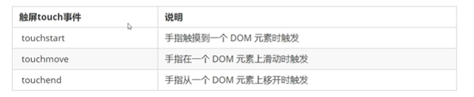
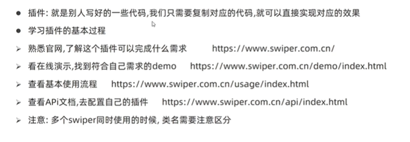
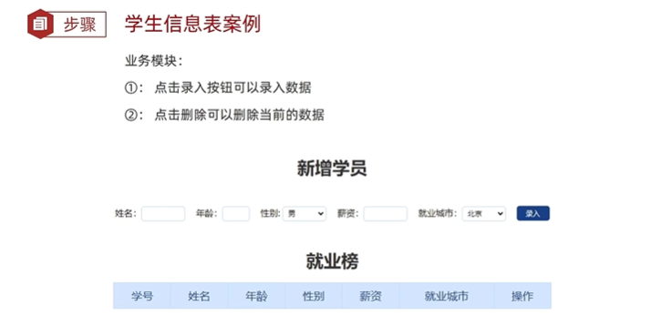
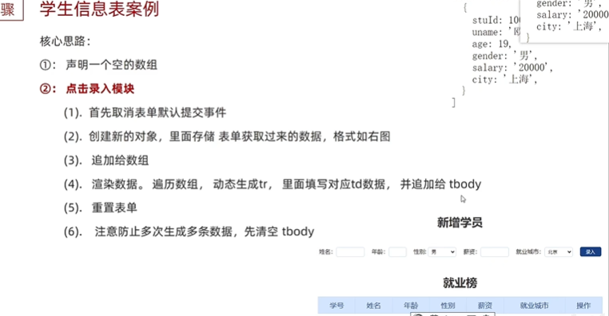
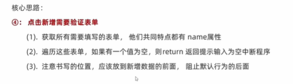

# Web APIs DOM节点操作



## 日期对象

目标：掌握日期对象，可以让网页显示日期

- 日期对象：用来表示时间的对象
- 作用：可以得到当前系统时间

学习路径：

1. 实例化

2. 日期对象方法

3. 时间戳

### 实例化

目标：能够实例化日期对象

- 在代码中发现了new关键字时，一般将这个操作成为<font color=red>实例化</font>

- 创建一个时间对象并获取时间

  - 获得当前时间

    ```javascript
    const date = new Date()
    ```

  - 获得指定时间

    ```javascript
    const date = new Date('指定时间字符串') // 可以带 具体时间；也可只写日期
    ```

### 日期对象方法

上面实例化对象显示的日期显示格式看起来不易懂，因此需要日期对象方法。

目标：能够使用日期对象中的方法写出常见日期

**使用场景**：因为日期返回的数据不易读、不能直接使用，所以需要使用日期对象方法，转化为实际开发中常见的格式。



月份：0代表1月，1代表2月；**月份+1才是真正的月份，其他的内容不需要变**

星期：星期日用0表示，其他的都是对应的。

**其他常见方法**

```javascript
const div = document.querySelector('div')
// 得到日期对象
const date= new Date()
div.innerHTML = date.toLocaleString() // YYYY/MM/DD hh:mm:ss
div.innerHTML = date.toLocaleDateString() // YYYY/mm/dd
div.innerHTML = date.toLocaleTimeString() // hh:mm:ss
```

### 时间戳

目标：能够获得当前时间戳

- 使用场景：如果**计算倒计时**，前面方法无法直接计算，需要借助于时间戳完成

- 什么是时间戳：唯一

  - 是指1970年01月01日00是00分00秒**至现在**的<font color=red>毫米数</font>，它是一种特殊的计量时间的方式

- 算法：

  - 将来的时间戳 - 现在的时间戳 = 剩余时间的毫秒数
  - **时间戳差值转换为时秒分形式**，即剩余时间毫秒数 转换为 剩余时间的 年月日时秒分 就是 倒计时时间

- **获取时间戳的三种方法：**

  1. 使用getTime()方法

     - 必须首先实例化，使用对象调用方法。

  2. **简写+new Date()方法**
   - 推荐使用
     
  
  3. Date.now() 
    
     - 无需实例化
     
     - 但是只能得到当前的时间戳，而前面的两种方式可以获得指定时间的时间戳
  
### 毕业倒计时案例




---

**小结**

1. 实例化日期对象怎么写？

   new Date()

2. 日期对象方法里面月份和星期有什么注意的？

   月份是0-11,使用需要加+

   Day星期是0-6,0代表星期日，1代表星期1

3. 获得时间戳的三种方式？

   - 实例化对象.getTime()
   - \+ new Date() 重点记住这个方法
   - Date.now()

## 节点操作

### DOM节点

目标：能够说出DOM节点的类型

- DOM节点

  - DOM树中的每一个内容都称之为节点

    

- 节点类型

  - **元素节点**
    - 所有的标签，比如body div
    - html是根节点
    - 重点记住，**可以让我们更好的理清标签元素之间的关系**
  - 属性节点：所有的属性 比如href class id 等
  - 文本节点：标签内的文本
  - 其他

### 查找节点

目标：能够具备根据**节点关系**查找目标节点的能力



本节讲解：父节点、子节点和兄弟节点

#### 父节点

- parentNode属性

- 亲父亲，返回最近一级的父节点，找不到返回为Null

  ```javascript
  子元素.parentNode
  ```

#### 子节点

- childNodes

  - 获得所有子节点，包括文本节点(空格和换行)、注释节点等

- <font color=red>children属性(重点)</font>

  - 仅获得所有元素节点
  - 返回的还是一个伪数组

  ```javascript
  父元素.children
  ```

#### 兄弟关系查找

1. 下一个兄弟节点

   nextElementSibling属性

2. 上一个兄弟节点

   previousElementSibling属性

---

**小结**

1. 查找父节点用哪个属性?

   - parentNode

2. 查找所有子节点用哪个属性？

   - children

3. 查找兄弟节点用哪个属性？

   - nextElementSibling

   - previousElementSibling

### 增加节点

目标：能够具备根据需求新增节点的能力

- 很多情况下，我们需要在页面中增加一条信息
- 一般情况下，新增节点，按照如下操作
  - 先创建：创建新的节点
  - 后放入：把创建的新的节点放入到指定元素内部

#### 创建节点

- 创造出一个新的网页元素，再添加到网页内，

- 创建**元素节点**的方法

  ```javascript
  // 创建一个新的元素节点
  document.createElement('标签名')   // 注意：创建的标签是字符串,需要添加引号
  ```

#### 追加节点

- 想要在界面看到，还得插入到某个父元素中

- 插入到父元素的最后一个子元素：

  ```javascript
  // 插入到这个父元素的最后
  父元素.appendChild(要插入的元素js对象) // 父元素JS对象,除了document
  ```

- 插入到父元素中某个子元素的前面

  ```javascript
  父元素.insertBefore(要插入的元素对象,在哪个元素之前) // 多了一个插入再哪个元素之前
  ```

#### 克隆节点

- 特殊情况下，我们新增节点，按照如下操作

  - 复制一个原有的节点
  - 把复制的节点放入到指定的元素内部

- 克隆节点

  ```javascript
  元素.cloneNode(布尔值)
  ```

  cloneNode会克隆出一个跟原标签一样的元素，括号内传入布尔值

  - 若为true，则表带克隆时会包含后代节点一起克隆。
  - 若为false，则代表克隆时不包含后代节点，**只克隆标签,标签内文字都不克隆**
  - 默认为false

### 删除节点

补充：改就是获取元素,使用属性=修改。其实已经学过了

目标：具备根据需求删除节点的能力

- 若一个节点在页面中已不需要时，可以删除它

- 在JavaScript原生DOM操作中，要删除的元素**必须通过父元素删除**

- 语法

  ```javascript
  父元素.removeChild(要删除的孩子元素)   // 必须是亲父亲和亲儿子
  ```

- 注

  - 如果不存在父子元素则删除不成功（<font color=red>删除人家父亲必须得同意</font>）
  - 删除节点和隐藏节点（display:none）有区别：隐藏节点节点还在，但是删除，则从html中删除节点

## M端事件

目标：了解M端常见事件

移动端也有自己独特的地方，比如<font color=red>触屏实践touch（也称为触摸事件）</font>，Adnroid和IOS都有。

- 触屏事件touch

- touch对象代表一个触摸点。触摸点可能是一根手指，也可能是一根触摸笔。触摸事件可相应用户手指（触摸笔）对屏幕或触控板操作。

- 常见的触屏事件如下

  

## JS插件：swiper

在移动端实现轮播图十分复杂，所以可以使用插件的方式，非常好用。



https://www.bilibili.com/video/BV1Y84y1L7Nn/?p=123&spm_id_from=pageDriver&vd_source=dde2f4dd432156027fedf9b1734ba705 游乐园案例没做

## 学生信息表案例



操作思路：



- 第一个模块：添加数据后渲染

- 第二个模块：删除

  主要技术：在添加渲染后，给删除的标签添加自定义属性：for循环+反义字符串。之后重新渲染。

- 第三个模块：<font color=red>表单非空验证</font>

  

一些细节补充：

- form标签中属性

  autocomplete=‘off’，代表表单框获得焦点时，不显示输入的历史信息。推荐

- **表单**

  问题：在写表单页面的时候，点击button按钮就会出现自动提交表单的情况。

  原因：form表单下的按钮在没有指定type类型的时候，button会有一个默认的type=”submit”

  解决办法：给button设置一个类型type="button"，这样button的类型就不是默认的submit了，就不会自动提交表单了。

  注意：form表单中的action属性的值是表单提交给的url，如果我们没有设置action属性，那么默认的表单还是提交给当前页面。

- reset()重置

  表单元素JS.reset() 将表单的状态恢复的最开始什么也没写的方法

  

  

  


