# 第一天 JS基础语法

[TOC]

## 导读

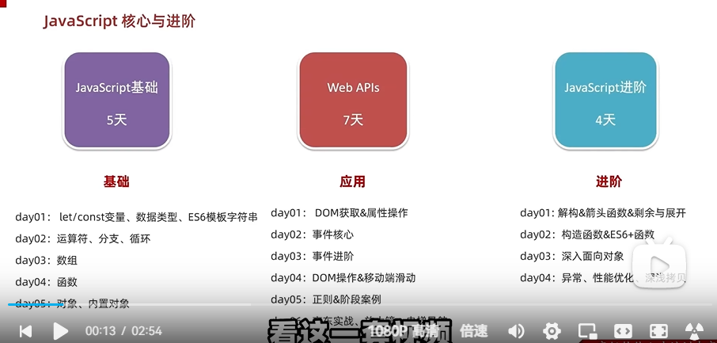

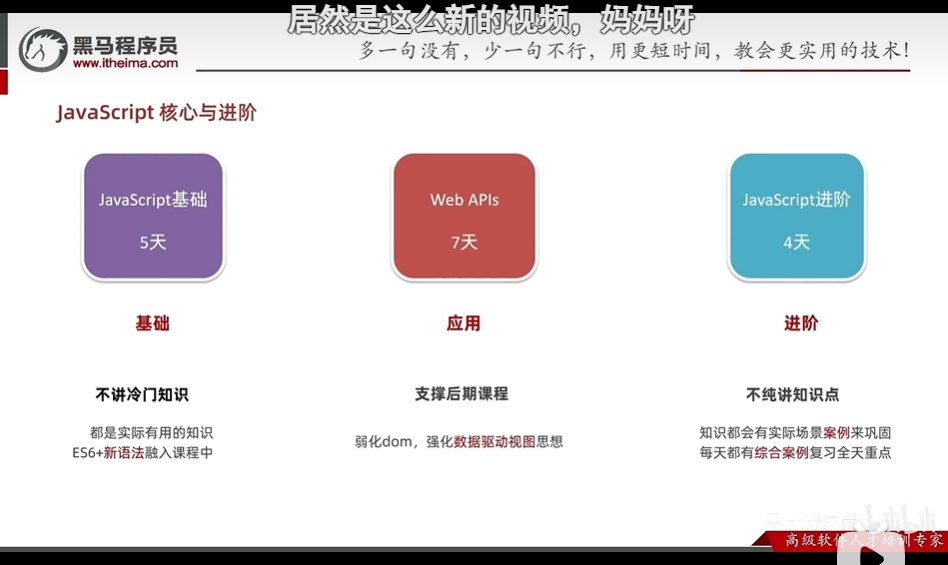

课后需要强化练习：

客观题扫码即可

## JavaScript简介和体验

### JavaScrpit是什么？

1. JavaScript是什么？

   是一种运行在**客户端（浏览器）**的**编程语言**，实现人机交互效果。

   (不像Java一样，运行需要配置各种环境。JS只需要浏览器)

2. 作用

   - 网页特效

     监听用户的一些行为让网页作出对应的反馈

   - 表单验证

     针对表单数据的合法性进行判断

   - 数据交互

     获取后台数据，渲染到前端

   - 服务端编程（node.js）

     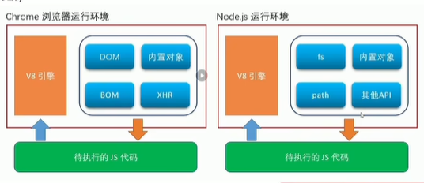

3. JavaScript的组成？

   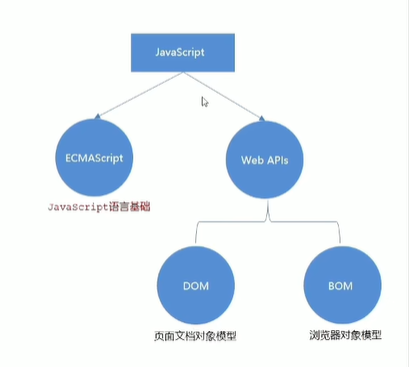

   - ECMAScrpit

     规定了JS基础语法核心知识。

     比如：变量、分支语句、循环语句、对象等等

   - Web APIs

     DOM：操作文档，比如对页面元素进行移动、大小、添加删除等操作

     BOM：操作浏览器，比如页面弹窗，检测窗口宽度、存储数据到浏览器等等

权威网站：MDN，直接百度MDN进去网页即可。

---

**总结**

- JS是一种运行在<font color=red>客户端</font>的编程语言

- JS由ECMAScript、Web APIs(DOM BOM)组成

### JavaScript书写位置

- CSS位置：
  - 行内样式表 
  - 内部样式表 style
  - 外部样式表 link 


- JS位置：

  - 行内JS

  - 内部JS
  - 外部JS


---

1.内部JavaScript

​	直接写在html文件里，用script标签包住

​	**规范**：script标签写在\</body>标签上面

**注意事项**:

​	将\<script>放在<font color=red>HTML文件的底部</font>附件的原因是：浏览器会按照代码在文件中的<font color=red>顺序加载</font>HTML。如果先加载JS期望修改其下方的HTML，那么它可能由于HTML尚未加载而失效。因此，将JavaScript代码放在HTML页面的底部附近通常是最好的策略。

2.外部JavaScript

代码写在以.js结尾的文件里

**语法**：通过script标签，引入到html页面中

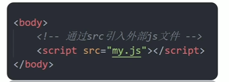

**注意事项**

- 引入了外部JS文件后，script标签不要再写代码，否则会被忽略。
- 外部JavaScript会使代码更加有序，更易于复用，且没有了脚本的混合，HTML也会更加易读，因此这是个好习惯。

3.内联JavaScript

代码写在标签内部

**语法**：

注意：此处作为了解即可，但是后面vue框架会用这种模式

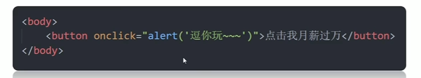

---

**总结**

- JavaScript的三种书写位置？

  内部、外部、行内

- 注意事项

  - 书写的位置尽量写到文档末尾\</body>标签
  - 外部js标签中间不要写代码，会被忽略

### JavaScript怎么写

#### 注释

- 单行注释

  - 符号：//

  - 快捷键：Ctrl + /

- 多行注释

  - 符号：/* */

  - 快捷键：Shift+Alt+A

#### 结束符

**符号**：使用英文的分号(;)，代表语句结束

**实际情况**：实际开发中，可写可不写，浏览器引擎会自动推断JS结束的位置

**现状**：实际开发中，越来越多人主张，省略结束符

<font color=red>**约定：为了风格统一，要么全加，要么全都不加**</font>

---

**总结**

1.注释的两种方式

​	单行注释

​	多行注释

2.javas结束符注意点

- 结束符是分号

- 结束符可以省略吗？

  可以省略。但是为了风格统一，要么每句都写，要么每句都不写。

### 输入和输出语法

目标：能写出常见JavaScript输入输出语法

**什么是语法：**

- 任何计算机打交道的规则约定
- 程序员要按这个规则去写
- 程序员操作计算机，需要让计算机能看懂

#### 输出语法

输出：浏览器显示出来给用户

语法1：

```javascript
document.write('要输出的内容')
```

**作用**：向body内输出内容，写入HTML文档

**注意**：如果输出的内容写得是标签，**也会被解析为网页元素**，而不是纯文字


语法2:

```javascript
document.getElementByID("id名").innerHTML = "要修改的内容"
```

**作用**：内容写入到HTML元素


语法3：

```javascript
alert('要输出的内容')
```

**作用**：页面弹出警告对话框


语法4：

```javascript
console.log('控制台打印')
```

小技巧：直接在vscode中写log，然后选择第二个

**作用**：控制台输出语法，程序员调试使用


#### 输入语法

输入：用户写入给浏览器，使用变量拿到

语法：

```
prompt('请输入您的姓名：')
```

**作用**：显示一个对话框包含文字信息+输入框；文字信息提示用户输入，输入框输入内容。

**展示**：

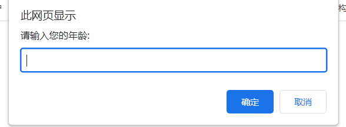


#### JavaScript代码执行顺序

- 按HTML文档流顺序执行JavaScript代码

- alert()和prompt()它们会跳过页面渲染先被执行(目前了解，后面详细讲解)

### 字面量

在计算机科学中，字面量(literal)是在计算机中描述 事/物。一般称为固定值为字面量。

比如：

- 我们的工资是:1000。1000时数字字面量

- “黑马程序员” 字符串字面量

- 还有接下来的

  []数组字面量 

  {}对象字面量 等等

### 总结

1.JavaScript是一门编程语言，可以实现网页交互效果。

2.JavaScript的书写位置？

​	内部、外部、行内

3.JavaScript的注释

​	单行注释、多行注释

4.JavaScript的结束符

​	分号，可加可不加按照团队约定

5.JavaScript输入输出语句

​	输入：prompt

​	输出：alert() ,document.write() , console.log()


## 变量

### 变量是什么？

**通俗**：变量是计算机用来**存储数据的容器**，它可以让计算机变得有记忆。

**白话**：变量就是一个装东西的盒子

**注意**：变量本身不是数据，它们仅仅是一个个<font color=red>用于存储数据的容器</font>。可以理解为是一个个用来装东西的盒子。

### 变量基本使用

#### 变量声明

要想使用变量，首先需要创建变量（也称为声明变量、定义变量）

**语法**

```javascript
let 变量名
```

- 声明变量有两部分：声明关键字、变量名

- let即关键字，所谓**关键字**是<font color=red>系统提供的专门用来声明（定义）变量的词语</font> 

**举例**

```javascript
<script>
   // 1.声明一个变量
   let age
   // 2.等号 赋值
   age = 18
</script>
```

#### 变量赋值

​	定义了一个变量后，就能够初始化它（赋值）。在变量名之后跟上一个“=”，然后是数值。

```javascript
变量名 =  变量值 //等号左右有空格
```

**注意**：**等号的两侧要有空格**

#### 变量初始化

简单点，也可以声明变量同时同时直接赋值。这种操作成为<font color=red>变量初始化</font>

```javascript
let 变量名 = 值
```

#### 更新变量

变量赋值后，还可以给它换值。

**语法**：

```javascript
变量名 = 新值
// 错误方法
let 变量名 = 新值 // 每个变量只能声明一次,let不允许多次声明一个变量
```

#### 声明多个变量

想在一个let语句中声明多个变量

```javascript
let 变量名1 = 值1, 变量名2 = 值2 
```

初始化不建议这么写，**提倡每个变量都分开写，一行只有一个变量，语义更好一些**。

但是在输出的时候，可以合起来写。

### 变量的本质

**内存**：计算机中存储数据的地方，相当于一个空间

**变量本质**：**是程序在<font color=red>内存</font>中申请一块用来<font color=red>存放数据的小空间</font>**。通过变量名找到这个空间，变量值存储在这个空间里面。

### 变量命名规则与规范

规则：必须遵守，不遵守会报错 (法律层面是否合法）

规范：建议，不遵守不会报错，但不符合业内通识 （道德层面）

#### 规则

- 变量名不能使用关键字

  关键字：有特殊含义的字符，如let、if

- 只能用下划线_、字母、数字、$符组成，**且不能数字开头**。不能使用CSS中的-符号
- 字母严格**<font color=red>区分大小写</font>**

#### 规范

- 起名要有意义

  不要出现a1,a2,...等

- 遵守**小驼峰命名法**

  第一个单词首字母小写，后面每个单词首字母大写，如userName

#### 变量拓展var和let

var现在开发中一般不再使用它，可能会在老版本中看到它

let为了解决var的一些问题

var声明：

- 可以先使用在声明（不合理）
- var声明过的变量可以重复声明（不合理）
- 比如变量提升、全局变量、没有块级作用域等

---

**思考**

1.变量一次能存几个值？

​	如果想一次存多个值就用数组。

2.如果我想保存一个班里5个人的姓名怎么办？

### 变量拓展-数组

#### 声明

数组（Array)——**一种将一组数据存储在单个变量名下**的优雅方式

```javascript
//专业: 逗号后面添加空格
let 数组名 = [数据1, 数据2, ..., 数据n]
// 示例
let names = ['小红', '小张', '小丽', '小米']
```

- 数组按顺序保存，每个数据都有自己的编号，编号从0开始到n-1

- 在数组中，数据的编号也叫<font color=red>索引或下标</font>

- 数组中可以存储任意类型的数据，数组里面各个数据的类型可以不同

#### 取值方法

取值方法：数组名[索引号]

#### 一些术语

**元素**：数组中保存的每个数据都叫数组元素

**下标**：数组中数据的编号

**长度**：数组中数据的个数，通过数组的length属性获得

---

**总结**

1.数组好处？

​	数组可以保存多个数据

2.数组字面量用什么表示？

​	中括号[]

### 常量

**概念**：使用const声明的**变量**称为‘常量’

**使用场景**：当某个变量永远**不会改变**时，可以使用const来声明，而不是let

**命名规范**：和变量一致

**常量使用**：

```javascript
// 声明一个常量
const G = 9.8
// 输出这个常量
console.log(G)
```

**注意**：<font color=red>常量不允许重新赋值，声明的时候必须赋值（初始化）</font>

**小技巧**：<font color=red>不需要**重新赋值**的数据使用const</font>

### 数据类型

#### 数据类型分类

计算机世界中的万事万物都是数据。

计算机可以处理大量的数据，为什么要给数据分类？

- 充分、高效利用内存

  简单数据类型放在内存中的一个地方、复杂的放在一种地方

- 方便程序员使用数据

---

**JS数据类型整体分为两大类**


- 基本数据类型

  1. 数字类型Number

     整数、小数、正数、负数，**只要是数字统称为数字类型**，不区分整数和小数等。

     ---

     **注意事项**

     <font color=red>JS是弱数据类型的语言</font>，只有赋了值才知道是什么类型。

     <font color=red>Java是强类型的数据语言</font>，如int num，不赋值也知道是什么类型。

     ---

     数字类型的目的就是为了运算，所以数字类型经常和**算术运算符**一起使用。

     - \+ 求和
     - \-  求差
     - \* 乘
     - /  除
     - % 取余 eg: 3 % 5 = 3 ;  5 % 3 = 2

     运算顺序：先乘除%后加减，有括号先算括号里的

     ---

     NaN：代表一个计算错误，它是一个不正确的或者未定义的数学操作所得到的结果

     ```javascript
     # 结果为NaN
     console.log('老师' -2 )  // NaN
     ```

     NaN是粘性的，任何对NaN的操作都会返回NaN

     ```javascript
     NaN + 2
     NaN / 2
     NaN * 2
     NaN == NaN  // 任何出现NaN结果都是NaN,而不是返回True
     ```

  2. 字符串类型

     <font color=red>通过单引号、双引号、或反引号包括的数据都叫字符串</font>，单引号和双引号没有本质上的区别，**推荐使用单引号**。

     ```javascript
     let s = 'pink'
     let s = '123456' //字符串类型,而不是数字类型
     let s = ''       // 这种叫做空字符串
     ```

     ---

     **注意事项**

     1. 无论单引号还是双引号，必须**成对使用**

     2. **单引号/双引号可以互相嵌套，但是不可以自己嵌套自己**，被嵌套的会被打印出为字符

     3. 必须时可以使用转义符 \\，输出单引号或双引号

     ---

     **字符串拼接**

     - **\+ 号实现字符串的拼接**

       ```javascript
       doucumet.write('我是' + 'PP')
       
       // 两个字符串变量的拼接输出
       let uname = '刘德华'
       let song = '忘情水'
       doucument.write(unmae + song )
       
       // 字符串和数字的拼接
       documnet.wirte('我今年' + 19) // +号可以字符串和数字可以参加拼接运算
           
       // 一部分变量一部分字符串,这样可以自动改变值
       let age = 18
       documnet.wirte('我今年' + age)  
       ```

       只要有字符串的+号，就**全部是拼接运算**

     - **模板字符串**

       **使用场景：**拼接字符串和变量。在没有它之前，要拼接变量比较麻烦，需要+号很多操作

       **语法：**字符串外层反引号，内容拼接变量时，用${}包住变量。

       **示例：**

       ```javascript
       let age = 18
       // 模板字符串
       // 外面用反引号``,里面是${变量名}
       document.write(`我今年${age}岁了`) // 输出的是变量的变量值
       ```

  3. 布尔类型boolean

     表示肯定或否定时在计算机中对应的是布尔类型数据

     它有两个固定的值true和false，一个表示肯定一个表示否定

     ```javascript
     // 布尔型声明,不用添加引号
     let isCool = true
     let isSun = false 
     console.log( 3 > 4 ) // 返回false值
     ```

  4. 未定义类型undefined

     未定义是比较特殊的类型,只有一个值undefined

     ---

     **申请情况出现未定义类型？**

     只声明/创建/定义变量，不赋值，变量的默认值制为undefined。一般很少**直接**为某个变量赋值为undefined。

     ---

     **工作中使用的场景：**

     开发中经常声明一个变量，等待传送过来的数据。

     如果不知道这个数据是否传过来，此时**可以通过检测这个变量是不是undefined，判断用户是否有数据传递过来**

  5. 空类型null

     null仅仅是一个代表”无“、”空“、或”值未知‘’的特殊值。

     ---

     **null和underfined区别**

     - underfind表示没有赋值
     - null表示赋值了，但是内容为空

     ---

     **null开发中的场景**
     官方解释：把null作为尚未创建的对象

     大白话：将来有个变量里面存放的是一个对象，但是对象还没创建好，可以先给null

     ```javascript
     // underfined和null 计算区别
     console.log(undefined + 1)  // 会发生错误，undefined还不知道是什么东西
     console.log(null + 1 )     // = 1,不发生错误
     ```

- 引用数据类型 

  不介绍

#### 检测数据类型

​	有时候用户传过来的数据，也不知道是什么类型，所以需要检测。

1. 控制台看输出的颜色

   **蓝色**：数字和布尔

   **黑色**：字符串和未定义

2. <font color=red>通过typeof</font>关键字检测数据类型

   **语法**：支持两种语法形式

   ```javascript
   // 1.作为运算符
   typeof 变量名 // 常用写法
   
   // 2.作为函数
   typeof(便命令)
   ```

### 类型转换

#### 为什么要类型转换

​	prompt获得的值的类型是全是字符串类型，哪怕用户输入的是数字，也是字符串。**此时需要转换变量的数字类型。**

​	通俗来说，就是<font color=red>把一种数据类型的变量转换成我们需要的数据类型。</font>

####  隐式转换

​	**某些运算符**被执行时，**系统内部自动**将数据类型进行转换，这种转换成为隐式转换。

**规则**：

- \+号**两边**只要有一个是字符串，都会把另外一个转换为字符串

  ```javascript
  console.log(2 + 2)    // 4
  console.log(2 + '2')  // 22
  ```

  

- <font color=red>**除了加号以外的**</font>运算符，比如\-,\*,/都会把数据转换为数字类型

  ```javascript
  console.log(2 - 2)   // 0
  console.log(2 - '2') // 0 -号自动发生了转换
  ```

**缺点**：

​	转换类型不明确，靠经验才能总结

**小技巧**：

- <font color=red>加号作为正号解析可以转换成数字型</font>(+号单用)

  ```javascript
  console.log('123')  //字符型
  console.log(+'123') //数字型,+号在最前面,单用
  ```

- <font color=red>任何数据和字符串相加结果都是字符串</font>

#### 显式转换

​	编写程序时，隐式转换是不严谨的。为了避免隐式转换带来的问题，通常根据逻辑显示转换数据类型。

- 字符型转换为数字类型

  1. Number(变量名/数据)

     ```javascript
     // 字符型转换为数字类型
     salary = prompt('请输入年薪：')
     console.log(Number(salary))
         
     sa = Number(prompt('年薪：'))
     ```

  2. 字符串前面添加加号（隐式转换）

     ```javascript
     let num = +prompt('请输入年薪：')
     ```

  3. parseInt

     ```javascript
     //只保留整数数字，忽略字符和小数
     console.log(parseInt('12.34px')) // 数字类型12
     console.log(parseInt('12px'))   //  数字类型12
     ```

  4. parseFloat

     ```javascript
     //保留整数和小数，忽略字符
     console.log(parseFloat('12.34px')) // 数字类型12.34
     ```

### 实战案例

需求：


输入后效果：


代码

```html
<!DOCTYPE html>
<html lang="en">
<head>
    <meta charset="UTF-8">
    <meta http-equiv="X-UA-Compatible" content="IE=edge">
    <meta name="viewport" content="width=device-width, initial-scale=1.0">
    <title>Document</title>
    <style>
        h2 {
            text-align: center;
        }
        table {
            /* 居中对齐 */
            margin: 0 auto;
            /* 文字居中对齐 */
            text-align: center;
        }
        table,
        th,
        td { 
            border: 1px solid #000;
            /* 合并相邻边框 */
            border-collapse: collapse ;
        }
        th {
            /* 不设置具体宽度,防止放不下内容，只设置padding */
            padding: 5px 20px;
        }
    </style>
</head>
    
<body>
    <h2>订单确认</h2>
    <table>
        <tr>
            <th>商品名称</th>
            <th>商品价格</th>
            <th>商品数量</th>
            <th>总价</th>
            <th>收货地址</th>
        </tr>
        <tr>
            <td>小米手机</td>
            <td id="price">100</td>
            <td id="num">10</td>
            <td id="total">1000</td>
            <td id="address">广州</td>
        </tr>
    </table>

    <script>
        // 1.用户输入
        let price = +prompt('请输入价格:')
        let num = +prompt('请输入数量:') 
        let address = prompt('请输入地址:')
        // 2.计算总额
        // 虽然乘号会自动转换字符串为数字类型,但是为了程序健壮性，还是要设置转换
        let total = price * num 
        // 3.打印内容到元素中
        document.getElementById('price').innerHTML = price
        document.getElementById('num').innerHTML = num
        document.getElementById('total').innerHTML = total
        document.getElementById('address').innerHTML = address
        // 也可以使用documnet.write()打印页面
        // 具体流程：
        // 1.剪切body内全部html标签
        // 2.使用字符串模板,将对应位置的内容改成${}形式即可
    </script>
    
</body>
</html>
```

效果预览

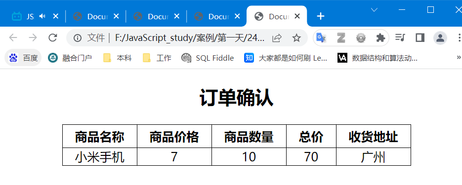

## 常见错误

1.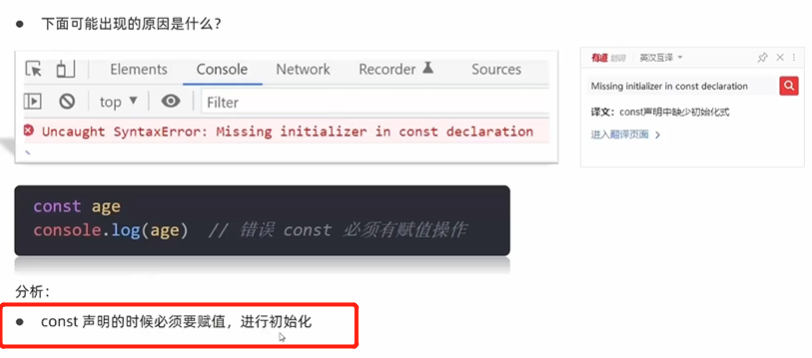

2.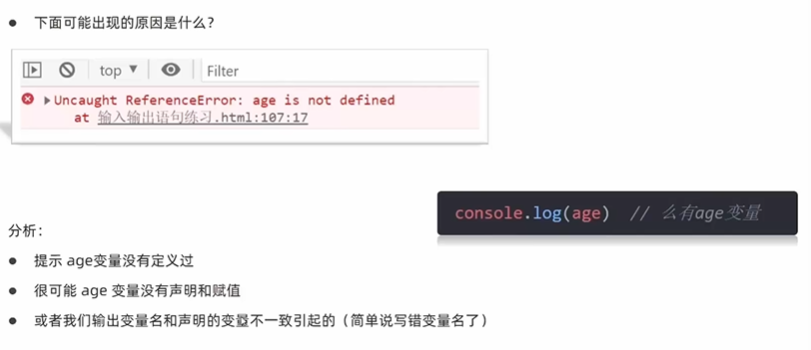

3.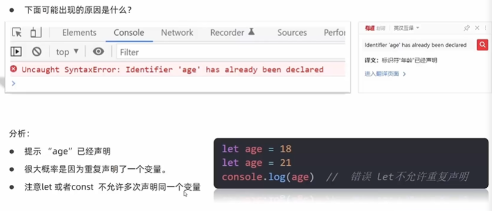

4.

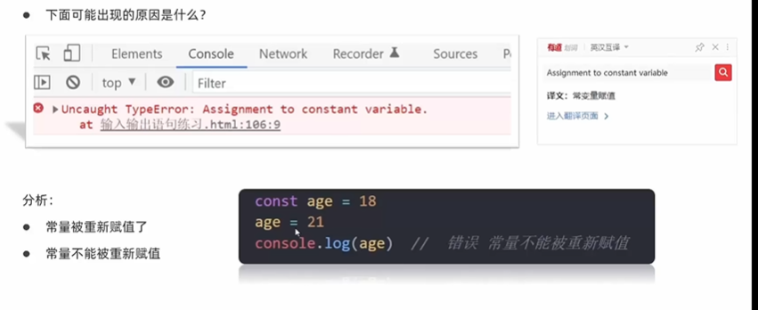

5.

